# CST8921 – Cloud Industry Trends

## Lab 1 – AI and ML

**Completed by: Olga Durham**
**St#: 040687883**

---

### Introduction

In this lab, students will explore Azure Machine Learning designer/AWS Sagemaker. This lab is designed as a complete beginner lab with little to no background in artificial intelligence or machine learning. Azure Machine Learning designer/AWS Sagaemaker is a great platform to introduce you to machine learning as you can build experiments with little to no code and without a deep understanding of algorithms or high-level math.

Students will also explore AML input modules to read dataset from various sources. Students will explore the ways to connect different data sources, retrieve data, get basic statistics and basic data visualization techniques. This will be a basis for the next sessions where students will be developing ML solutions for the problems.

Azure Machine Learning provides a data science platform to train and manage machine learning models. In this lab, you'll create an Azure Machine Learning workspace and explore the various ways to work with the workspace. The lab is designed as an introduction of the various core capabilities of Azure Machine Learning and the developer tools.

### Objective

The goal of this lab activity is to familiarize students with the concepts, techniques and use cases of machine learning using Azure AI and ML services.

### Prerequisites

- Basic understanding of cloud computing concepts, AI and ML concepts and python.
- A computer with internet access and python jupyter notebook installed on local.
- Windows, Mac or Linux machine
- Web browser
- Cloud portal access

[ML Tutorial: Train a no-code regression model using designer](https://learn.microsoft.com/en-us/azure/machine-learning/tutorial-designer-automobile-price-train-score?view=azureml-api-1)

### Lab Activity Overview

1. Create an Azure Machine Learning workspace in the Canada Central region. Once created, become familiar with the interface, including how to access designer as well as create and attach compute to work with a pipeline.

   | Setting             | Value                |
   |:--------------------|:---------------------|
   | Subscription        | `Azure for Students` |
   |Resource Group       | `aml-lab-rg`         |
   |Workspace Name       | `aml-lab-workspace`  |
   |Region Canada        | `Central`            |
   |Storage Account      | `Auto-created`       |
   |Key Vault            | `Auto-created`       |
   |Application Insights | `Auto-created`       |

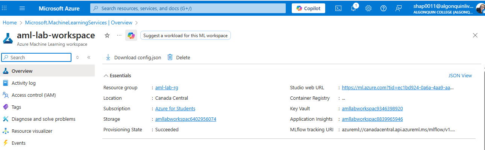

2. Explore the Azure Machine Learning studio which is a web-based portal that can be accessed through azure machine learning workspace.

- Note the Authoring section, which includes Notebooks, Automated ML, and Designer. These are the three ways you can create your own machine learning models within the Azure Machine Learning studio.

  **Authoring Section:** The Authoring section provides three ways to create ML models:
  1. Notebooks – Code-based development using Python
  2. Automated ML – Auto-generated models
  3. Designer – Visual drag-and-drop pipeline builder

- Note the Assets section, which includes Data, Jobs, and Models among other things. Assets are either consumed or created when training or scoring a model. Assets are used to train, deploy, and manage your models and can be versioned to keep track of your history.

  **Assets Section:** Assets represent objects used or produced during ML workflows. Data
  1. Jobs
  2. Models
  3. Pipelines
  4. Environments

- Note the Manage section, which includes Compute among other things. These are infrastructural resources needed to train or deploy a machine learning model.
  Manage Section: The Manage section contains infrastructure resources such as:
  1. Compute Instances
  2. Compute Clusters
  3. Endpoints

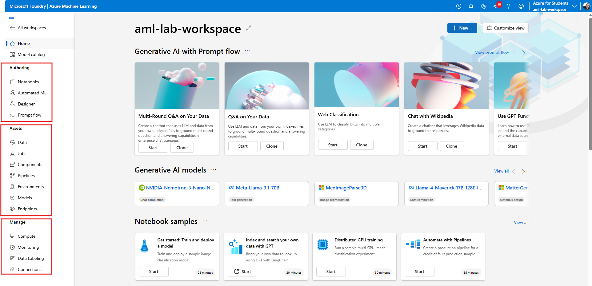

**_Authoring Section_**

The **Authoring** section in **Azure Machine Learning Studio** provides different ways to create and train machine learning models. It includes **Notebooks** for code-based development using Python, **Automated ML** for automatically generating models, and **Designer**, which allows users to build machine learning pipelines using a visual drag-and-drop interface. In this lab, the Designer tool is used to create a no-code regression model.

**_Assets Section_**

The **Assets** section contains all the resources that are created or used during the machine learning workflow. This includes **datasets, jobs, models, pipelines, and environments**. These assets help track experiments, manage versions, and review outputs such as trained models and execution results.

**_Manage Section_**

The **Manage** section is used to configure and control the infrastructure required for machine learning tasks. It includes **compute instances, compute clusters, and endpoints**. These resources provide the processing power needed to train models and deploy them for use.

3. Create a training pipeline – Train the model using designer
   _Pipeline Draft canvas_
   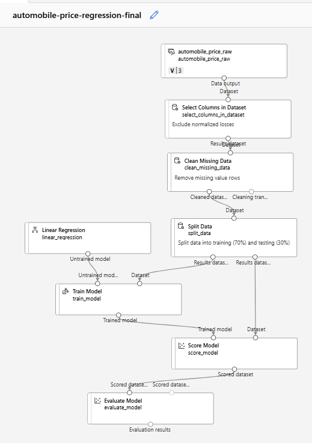

The pipeline was completed by adding data cleaning, splitting, training, scoring, and evaluation components.
The final version of the training pipeline was saved and used for submission.

4. Explore the Automobile Price Dataset (Raw)
   _Dataset Preview (Table View)_
   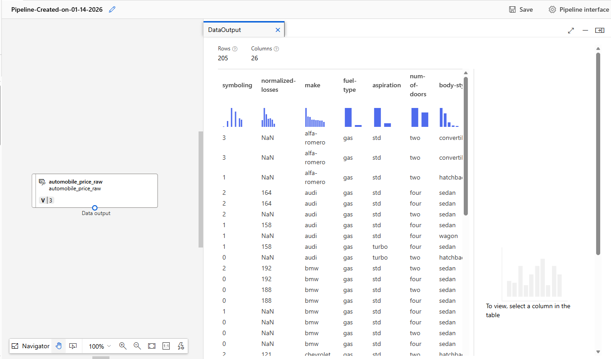
   _Column Statistics Panel and Data Visualization (Bar Chart)_
   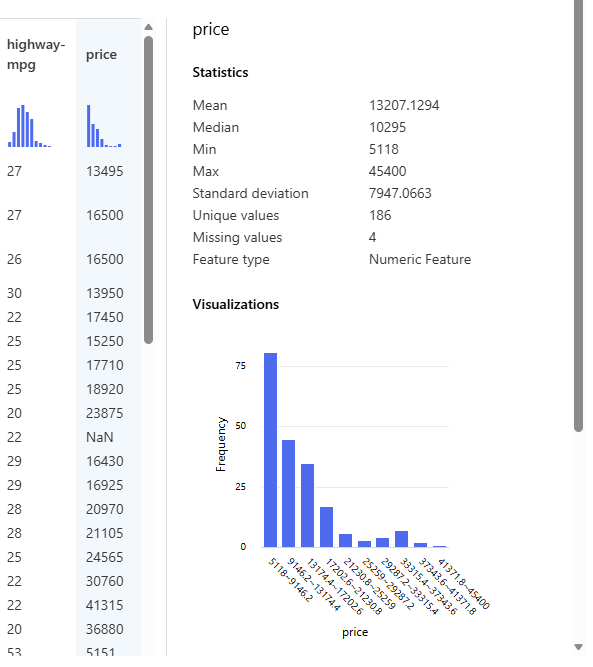

**_Data Exploration and Visualization_**

The **Automobile price data (Raw)** dataset was explored using the Preview Data feature in **Azure Machine Learning Designer**. The dataset contains 205 rows and 26 columns, where each row represents an automobile and each column represents a specific attribute such as engine size, horsepower, fuel type, and price.

By selecting individual columns, summary statistics and visualizations were automatically generated by Azure Machine Learning. Numeric features such as price and engine size displayed distributions using bar charts, while categorical features showed frequency counts. This exploratory analysis helped provide a better understanding of the data structure, value ranges, and feature distributions before training the regression model.

5. Select Configure & Submit

_Configure and submit. Set up pipeline panel is opened_

After creating the initial training pipeline in Azure Machine Learning Designer, the **Configure & Submit** option was selected to begin the pipeline execution process.

6. Create new experiment and set the name as `train-regression-designer-ml`

_Experiment Name_
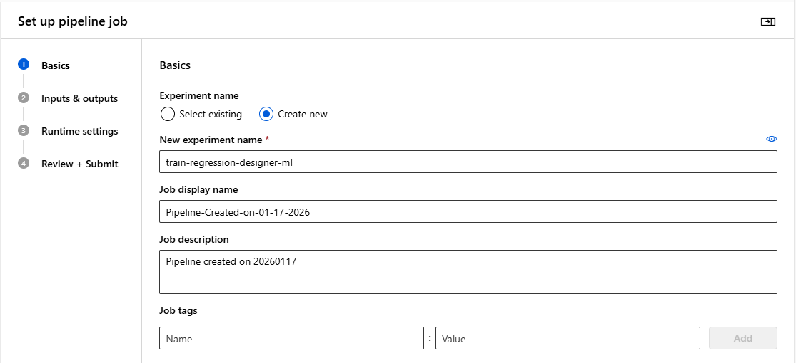

A new experiment named `train-regression-designer-ml` was created to organize and track the execution of the regression training pipeline.

7. On the Inputs & outputs page select Next without making any changes

_Inputs & Outputs Page_

No pipeline-level inputs or outputs were configured, as all required data and components were defined directly within the Designer pipeline.

8. On the Runtime settings page an error appears as you don´t a default compute to run the pipeline, to avoid this error create a compute instance target

_Runtime Settings Error_
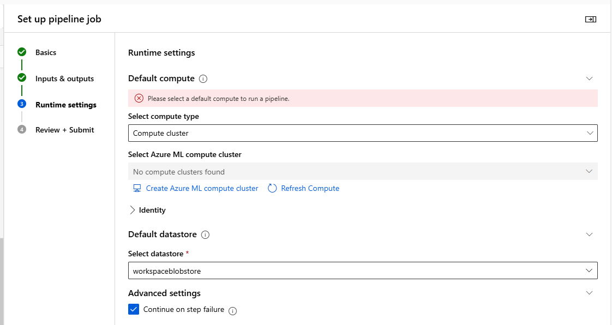

On the Runtime settings page, an error was displayed indicating that no default compute was selected to run the pipeline.

9. Create a new azure ml compute instance – select Standard_DS11_v2 from the recommended option.

_Standard_DS11_v2, new Azure ML compute instance_
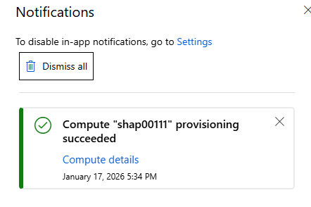

10. Create and wait for the instance to start until it’s running.

_Runtime Setting Final_
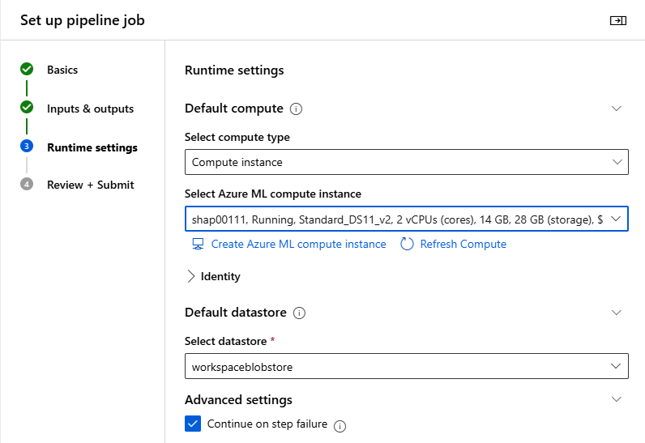

11. Execute your training pipeline

_Pipeline Job Running Notification_
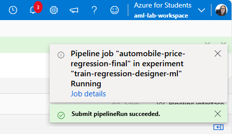

The Azure Machine Learning compute instance automatically entered a stopped state when idle. The instance was restarted prior to pipeline submission and successfully used to execute the training pipeline.

_Pipeline job completed_
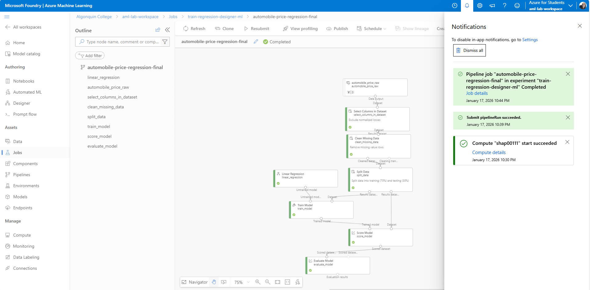

12. Use jobs tab to review your workload and see the status of the pipeline if it has executed successfully or failed.

_Pipeline job overview_
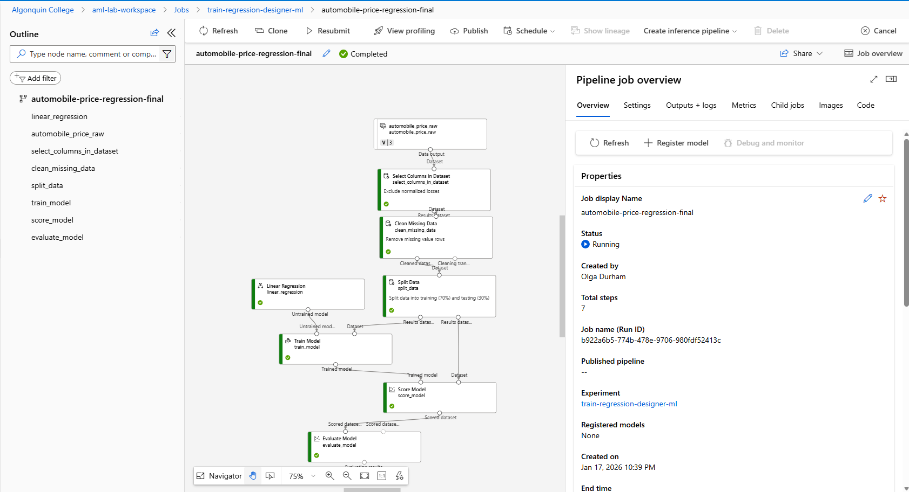
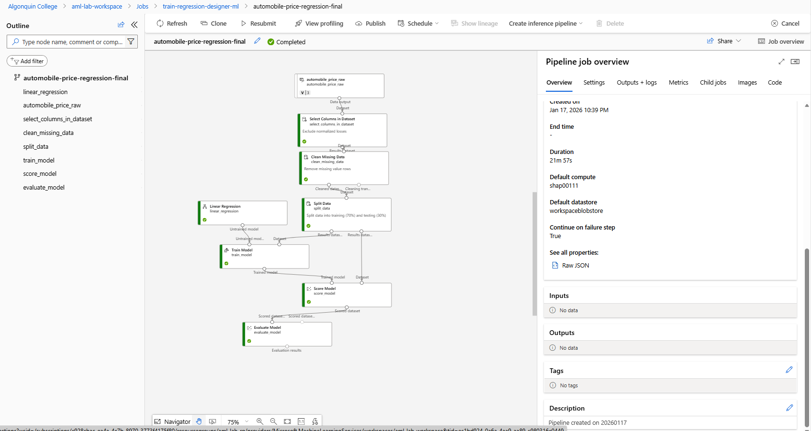

The pipeline execution status was monitored in Azure Machine Learning Studio. The pipeline job completed successfully, as indicated by the Completed status displayed in the pipeline overview.

13. When the job is completed, view the details of each individual component run, including the output. Explore the pipeline to understand how the model is trained.

_View Scored Dataset. Price_
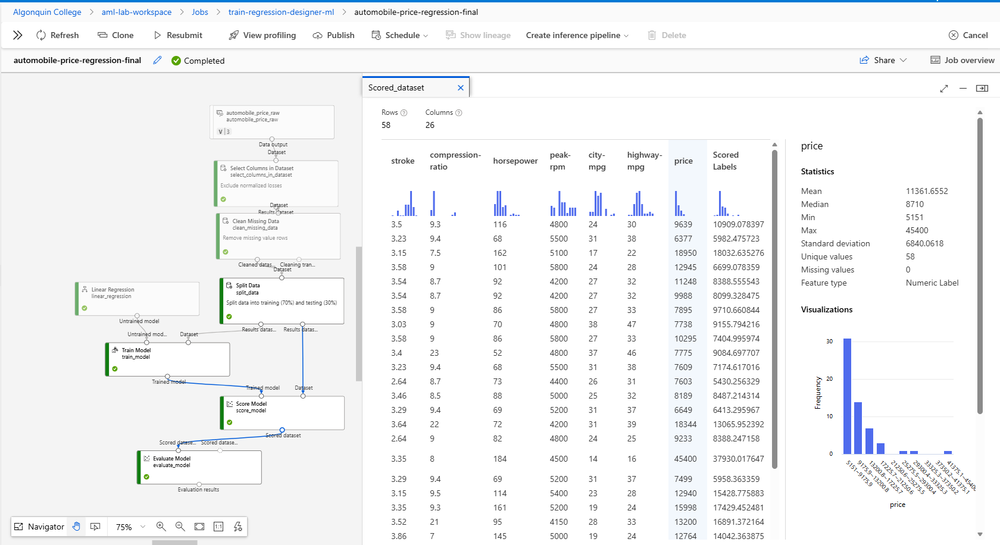

_View Scored Dataset. Scored Labels_
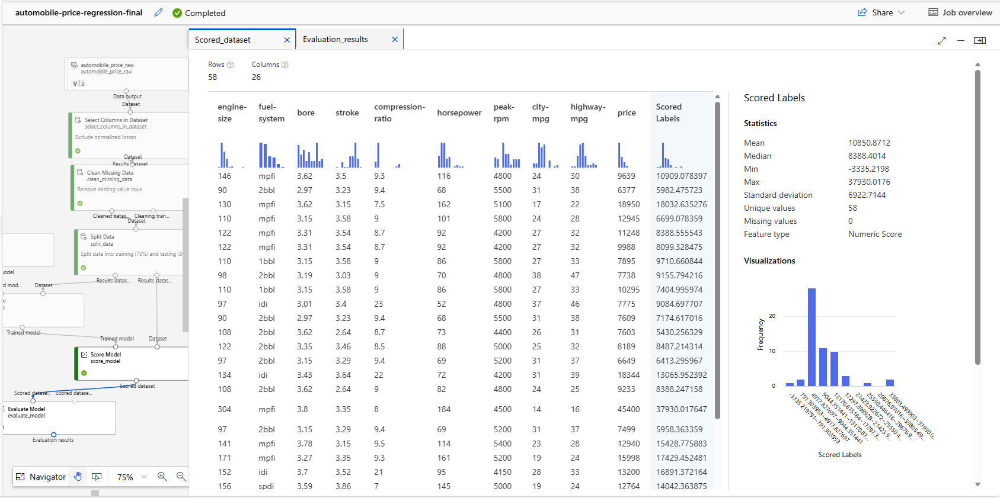

_View Evaluation Results_
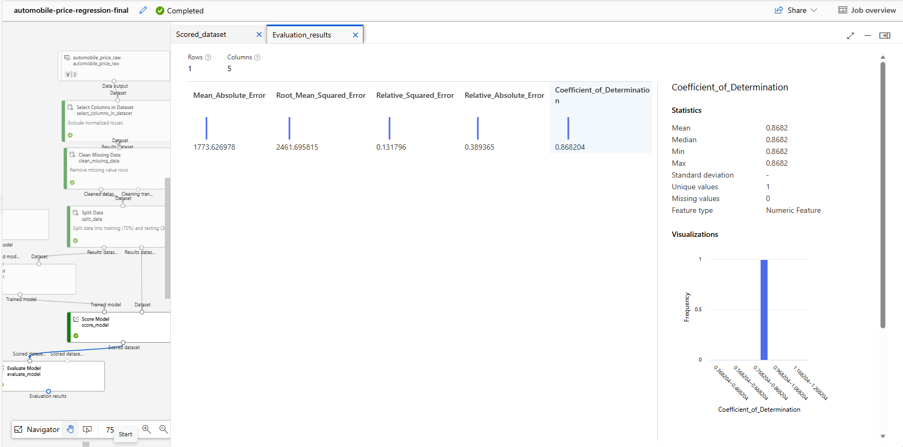

The trained regression model was evaluated using the **Evaluate Model** component. The output metrics included **Mean Absolute Error (MAE)**, **Root Mean Squared Error (RMSE)**, **Relative Absolute Error**, **Relative Squared Error**, and the **Coefficient of Determination (R²)**. In general, smaller error values indicate predictions closer to the actual prices, and an R² value closer to 1.0 indicates a better fit.

14. Delete all the resources created in the lab.

_Deleted resource group aml-lab-rg_
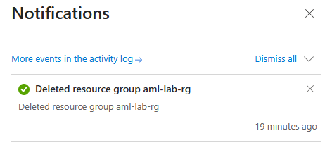

After completing the lab, all Azure resources created during the activity were deleted by removing the associated resource group. This ensured that no unnecessary cloud resources remained active.

### Reflection

This lab provided hands-on experience with Azure Machine Learning Designer and demonstrated how machine learning workflows can be created without writing code. By exploring data, building a regression pipeline, configuring compute resources, and evaluating model performance, I gained a better understanding of how cloud-based machine learning systems operate in practice. The lab also highlighted the importance of properly managing cloud resources and troubleshooting common platform issues.

### Conclusion

This lab demonstrated how Azure Machine Learning Designer can be used to build, train, and evaluate a regression model without writing code. Through data exploration, preprocessing, model training, and evaluation, the lab provided a practical introduction to cloud-based machine learning workflows.
