# CST8921 – Cloud Industry Trends

## Lab 2 – Cloud Security trends

**Completed by: Olga Durham**
**St#: 040687883**

---

### Introduction

In this lab, students will explore and understand the criticality of cloud security in industries. A crucial component of cloud security is focused on protecting data and business content, such as customer orders, secret design documents, and financial records. Preventing leaks and data theft is critical for maintaining your customers’ trust and protecting the assets that contribute to your competitive advantage. Cloud security's ability to guard your data and assets makes it crucial to any company switching to the cloud.
Cloud security ensures your data and applications are readily available to authorized users. You'll always have a reliable method to access your cloud applications and information, helping you quickly act on any potential security issues.

### Objective

The goal of this lab activity is to familiarize students with the concepts, techniques and use cases of cloud security using AWS/Azure/GCP

### Prerequisites

- Basic understanding of cloud security concepts
- A computer with internet access
- Windows or mac machine
- Web browser
- Cloud portal access with any cloud service providers (AWS, Azure, GCP)

---

### Lab Activity Overview

#### Task 1: Create an Azure Policy – Allowed Locations

**Purpose:** Ensure resources can only be deployed in an approved region.

Steps:

1. Sign in to the **Azure Portal**
2. Search for **Policy**
3. Select **Definitions**
4. Search for the built-in policy:
    - **“Allowed locations”**
5. Select the policy → Click **Assign**
6. Configure:
    - **Scope:** `Subscription`
    - **Allowed locations:** `Canada Central`
7. Review + Create

*Creating policy assignment notification*
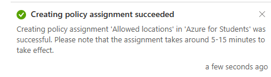

Validation:

- Attempt to create a resource in a different region (e.g., East US)
- Confirm deployment `fails`

*Deployment validation fails*
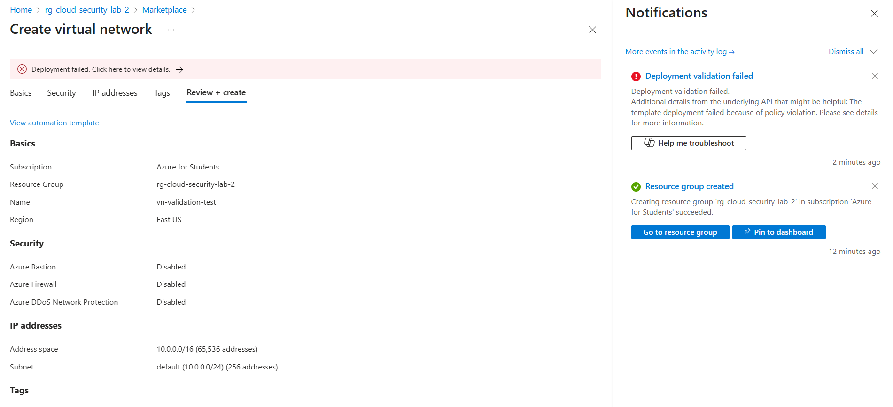

A resource group was created successfully since Azure Policies do not restrict resource group locations. To validate the policy, a virtual network was attempted to be deployed in the East US region. The deployment failed due to the “Allowed locations” policy, confirming correct policy enforcement.

---

#### Task 2: Create a Virtual Network (Canada Central)

**Purpose:** To establish a secure network boundary that will later host private and public subnets.

Steps:

1. Search for **Virtual Networks**
2. Select **Create**
3. Configure:
    - Region: `Canada Central`
    - Address space: `10.0.0.0/16`
4. Do **not** add subnets yet
5. Review + Create

*VNET created Canada Central*
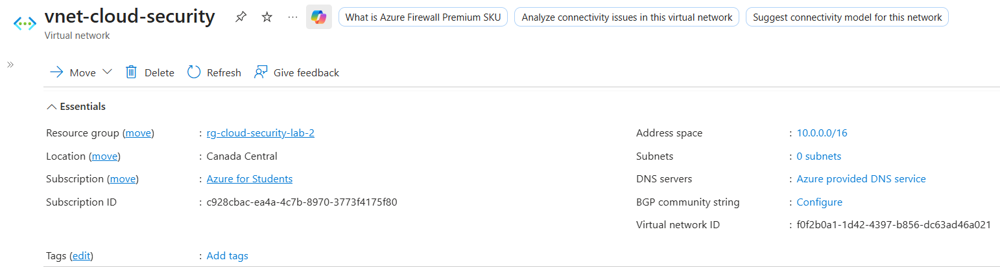

A virtual network was created in the Canada Central region with an address space of 10.0.0.0/16. No subnets were added at this stage to allow controlled subnet creation and security configuration in later tasks.

---

#### Task 3: Create Subnets & Enable Storage Service Endpoint

**Purpose:** To separate private and public network traffic and ensure storage traffic stays within Azure’s backbone network using a Service Endpoint.

Subnets to Create:

|Subnet Name    | Address Range  | Purpose         |
|:--------------|:---------------|:----------------|
|private-subnet | 10.0.1.0/24    | Secure access   |
|public-subnet  | 10.0.2.0/24    | Internet-facing |

Steps:

1. Open the Virtual Network
2. Go to **Subnets**
3. Add **private-subnet**
    - Enable **Service Endpoint**
    - Service: **Microsoft.Storage**
4. Add **public-subnet** (no service endpoint)

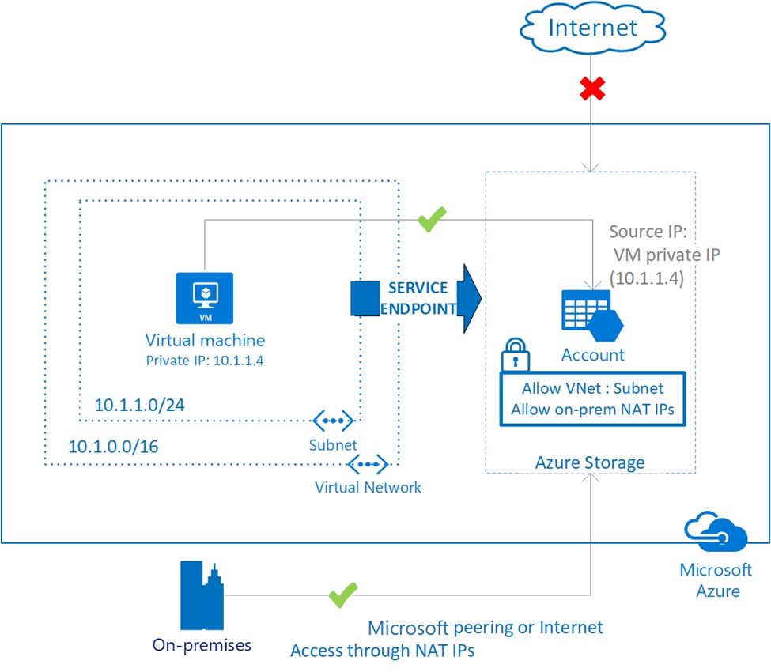

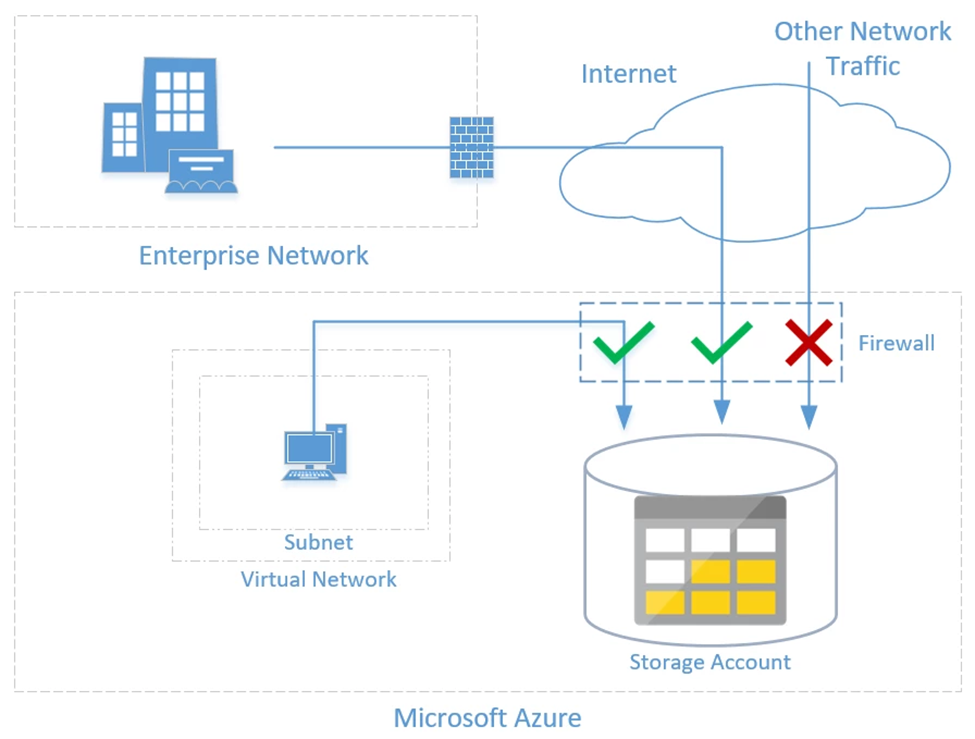

*Private and Public subnets created*
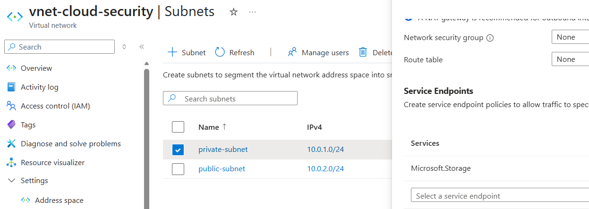

Two subnets were created within the virtual network. The private-subnet (10.0.1.0/24) was configured with a Microsoft.Storage service endpoint to ensure secure storage access over Azure’s backbone network. The public-subnet (10.0.2.0/24) was created without service endpoints to allow internet-facing resources.

---

#### Task 4: Create Network Security Group (NSG)

**Purpose:** To control inbound and outbound traffic at the subnet level, specifically protecting the private subnet.

Steps:

1. Search for **Network Security Groups**
2. Create NSG in **Canada Central**
3. Associate NSG to **private-subnet**

*Create the network security group*
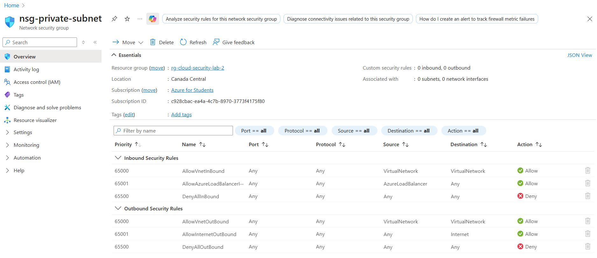

*Associate NSG with private-subnet*
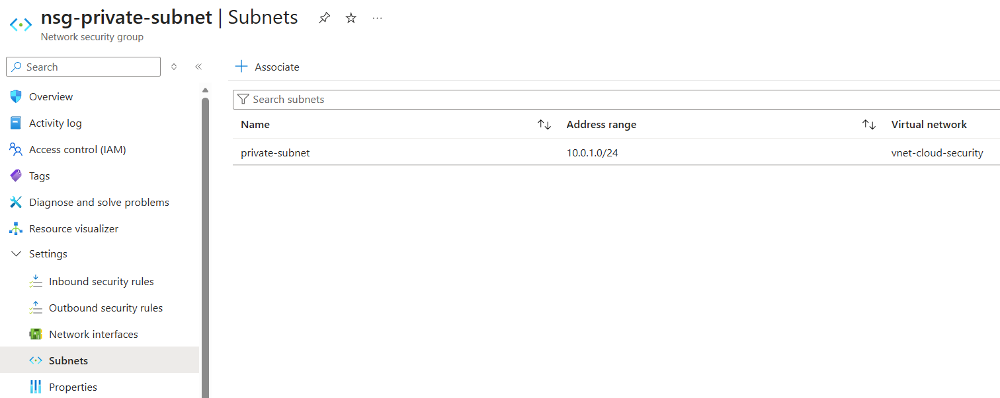

A Network Security Group was created in the Canada Central region and associated with the private subnet. This NSG will be used to enforce outbound and inbound traffic rules to enhance network security.

---

#### Task 5: Configure NSG Rules (Private Subnet)

Outbound Rule – Allow Azure Storage

**Purpose:** To allow secure access to Azure Storage while blocking outbound internet access from the private subnet.

- Destination: **Service Tag**
- Service Tag: **Storage**
- Action: **Allow**
- Priority: `100`

Outbound Rule – Deny Internet Access

- Destination: **Internet**
- Action: **Deny**
- Priority: `200`

*Outbound security rules private-subnet*
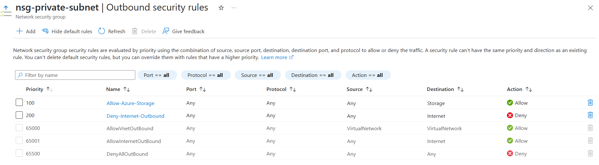

Outbound NSG rules were configured to allow traffic to Azure Storage using service tags while denying all other internet-bound traffic. This ensures that resources in the private subnet can securely access storage without unrestricted internet access.

---

#### Task 6: Configure NSG for Public Subnet (RDP Access)

Inbound Rule – Allow RDP

**Purpose:** To allow remote administration (RDP) access to a virtual machine deployed in the public subnet.

- Source: `Any`
- Port: `3389`
- Protocol: `TCP`

*Create NSG public-subnet*
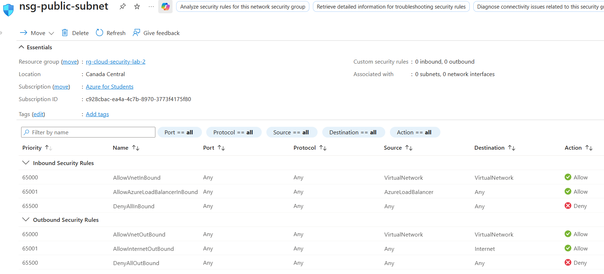

*NSG public-subnet associated*
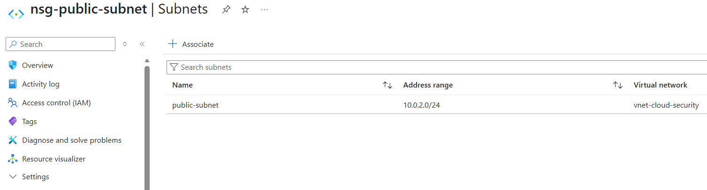

A Network Security Group was created for the public subnet and configured to allow inbound RDP traffic on port 3389. This NSG was associated with the public subnet to enable remote access to public-facing virtual machines.

---

#### Task 7: Create a Storage Account with File Share

**Purpose:** Secure storage access to only approved subnets.
To ensure Azure Storage is accessible only from the private subnet, enforcing network-level security.

Steps:

1. Create Storage Account
    - Region: Canada Central
2. Go to Networking
3. Set:
    - Network access: Enabled from selected networks
    - Allow access only from private-subnet
4. Create Azure File Share

*Storage Account with File Share*
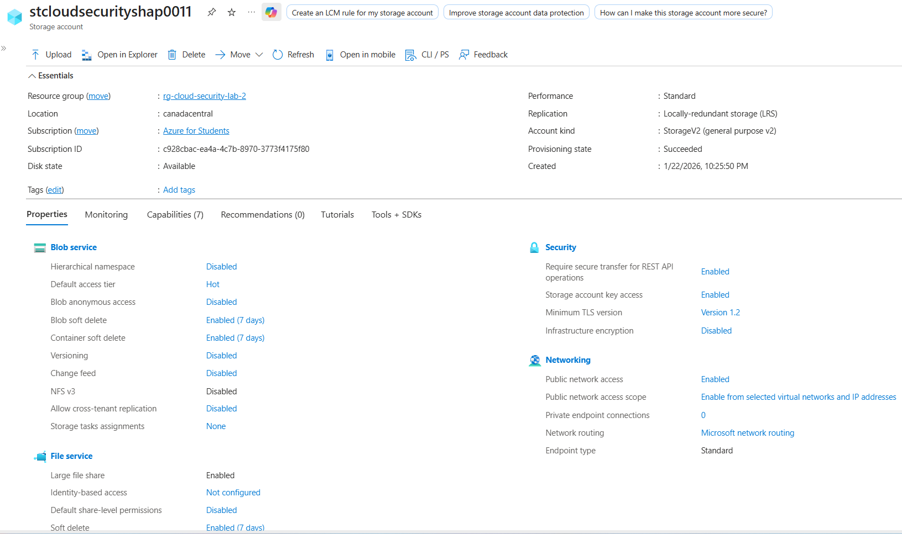

The storage account was configured with Standard performance and optimized for Azure Files to support secure file share access from the private subnet.

---

#### Task 8: Deploy Virtual Machines

**Purpose:** To deploy two Windows virtual machines in different subnets and enable secure access using Azure Bastion.

Deploy two Windows VMs:

|VM Name     | Subnet          |
|:-----------|:----------------|
|vm-private  | private-subnet  |
|vm-public   | public-subnet   |

- Enable **Azure Bastion**
- Use same credentials for both VMs

*VM private*
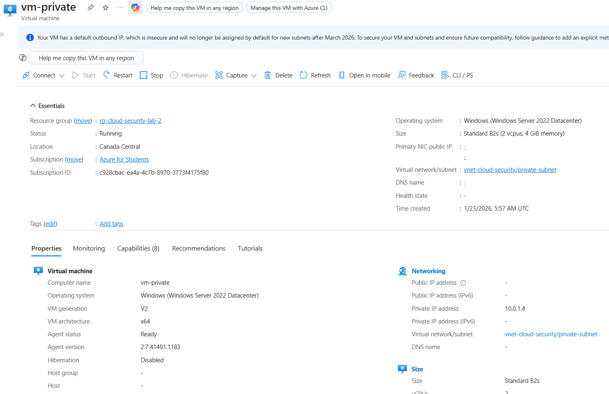

*VM public*


*Bastion*
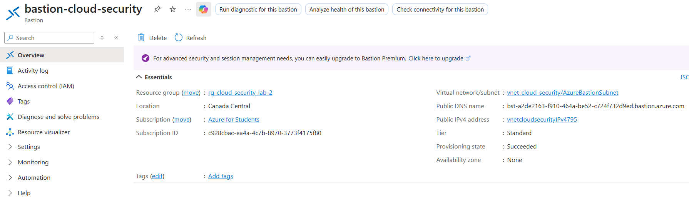

*Subnets*


Two Windows virtual machines were deployed in separate subnets. The private VM was placed in the private subnet without a public IP, while the public VM was deployed in the public subnet. Azure Bastion was enabled to provide secure remote access to both virtual machines. A dedicated AzureBastionSubnet was created as required by Azure to isolate Bastion infrastructure and avoid exposing RDP directly to the internet.

---

#### Task 9: Test Storage Access from Private Subnet (Allowed)

1. Connect to vm-private using Bastion
2. Open Windows PowerShell
3. Run the following command:

```
<<<<<<< HEAD
# NOTE: Access key removed from report to avoid exposing secrets.
# Use an environment variable or retrieve the key securely from Azure Portal.
=======
# Key intentionally NOT stored in repo.
$storageAccountName = "stcloudsecurityshap0011"
$shareName = "fileshare1"
$storageKey = "<REDACTED>"   # obtain from Azure Portal when running the lab

$secureKey = ConvertTo-SecureString $storageKey -AsPlainText -Force
$credential = New-Object System.Management.Automation.PSCredential ("Azure\$storageAccountName", $secureKey)

```

**Expected Result:**
Azure file share successfully mapped to drive **Z:**

*VM private storage access allowed*
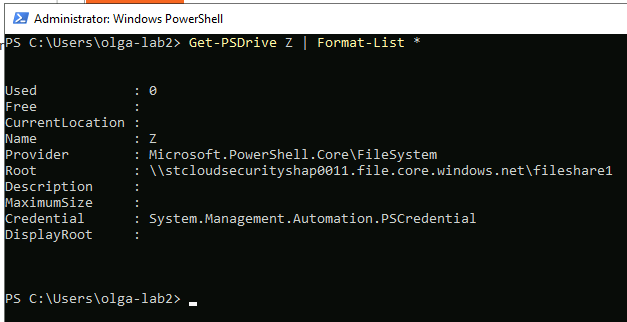

From the private virtual machine, the Azure File Share was successfully mapped to drive Z:. This confirms that storage access is allowed from the private subnet as intended by the network security configuration.

---

#### Task 10: Test Storage Access from Public Subnet (Denied)

1. Connect to **vm-public**
2. Repeat the same PowerShell command

**Expected Result:**
Access denied error

*VM public storage access denied*
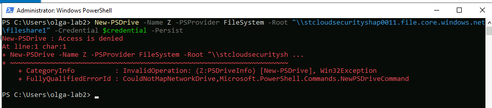

When attempting to access the Azure File Share from the public virtual machine, the connection was denied as expected. This confirms that the storage account’s network rules correctly restrict access to the private subnet only, preventing unauthorized access from public-facing resources. This demonstrates effective network-level security enforcement in Azure.

---

#### 6. Validation Summary

|Scenario                                 | Expected Outcome |
|:----------------------------------------|:-----------------|
|Resource creation outside Canada Central |Blocked           |
|Storage access from private subnet       |Allowed           |
|Storage access from public subnet        |Denied            |

---

#### 7. Cleanup (Mandatory)

To avoid unexpected costs:

- Delete:
  - Virtual Machines
  - Storage Account
  - NSGs
  - Virtual Network
  - Azure Policy assignment

*Cleanup RG deleted*


*RG deleted*
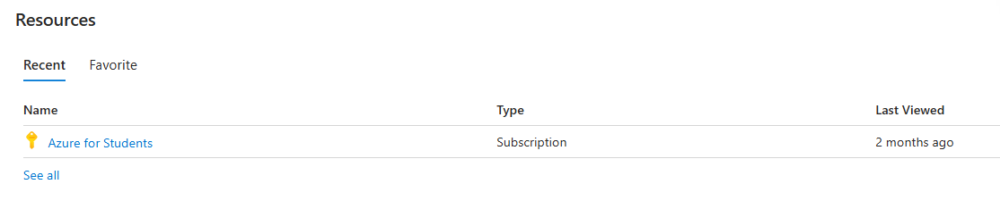

The resource group deletion was initially blocked by a Recovery Services Vault (Azure Backup). The vault contained a soft-deleted Azure Storage container (stcloudsecurityshap0011). Using Azure Cloud Shell (PowerShell), the storage container was unregistered, the vault was deleted, and then the resource group was successfully deleted.

---

### Summary

This lab demonstrated how cloud security controls can be implemented and validated using Microsoft Azure. Azure Policy was used to restrict resource deployment to an approved region, network security groups controlled traffic flow, and storage account networking rules ensured that sensitive data was accessible only from trusted subnets.

---

### Conclusion

The lab showed how Azure security features such as policies, network segmentation, service endpoints, and access controls help protect cloud resources. By validating both allowed and denied access scenarios and properly cleaning up all resources, this lab reinforced best practices for securing cloud environments.
