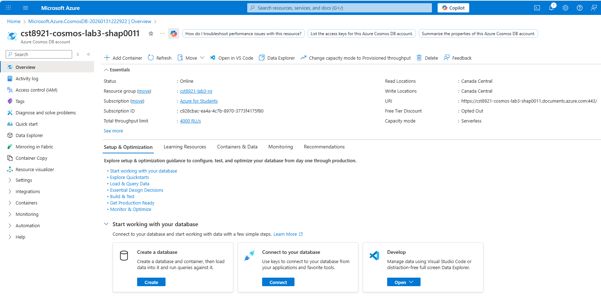
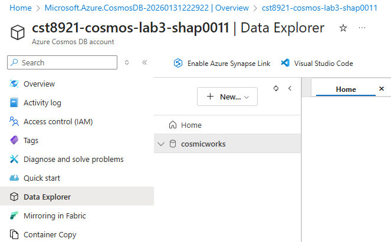
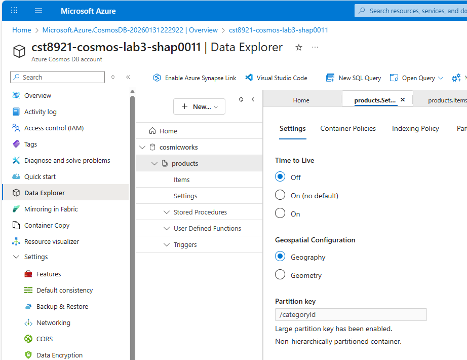
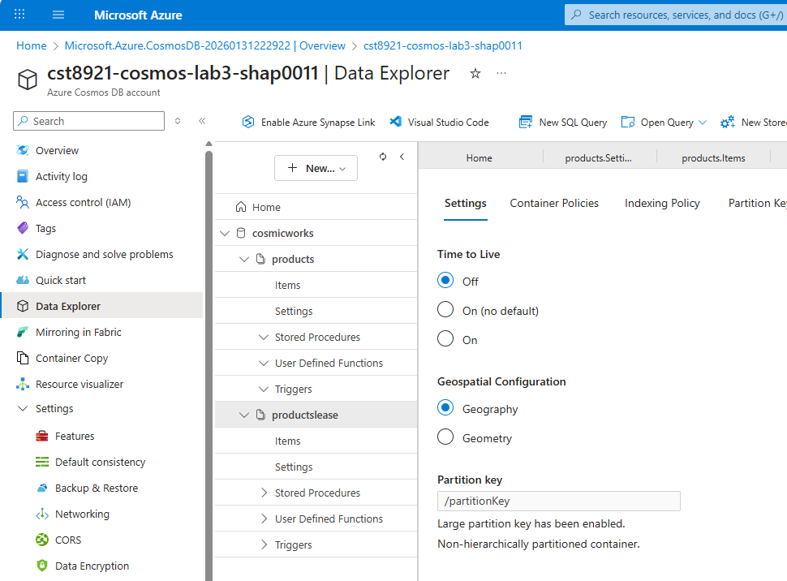
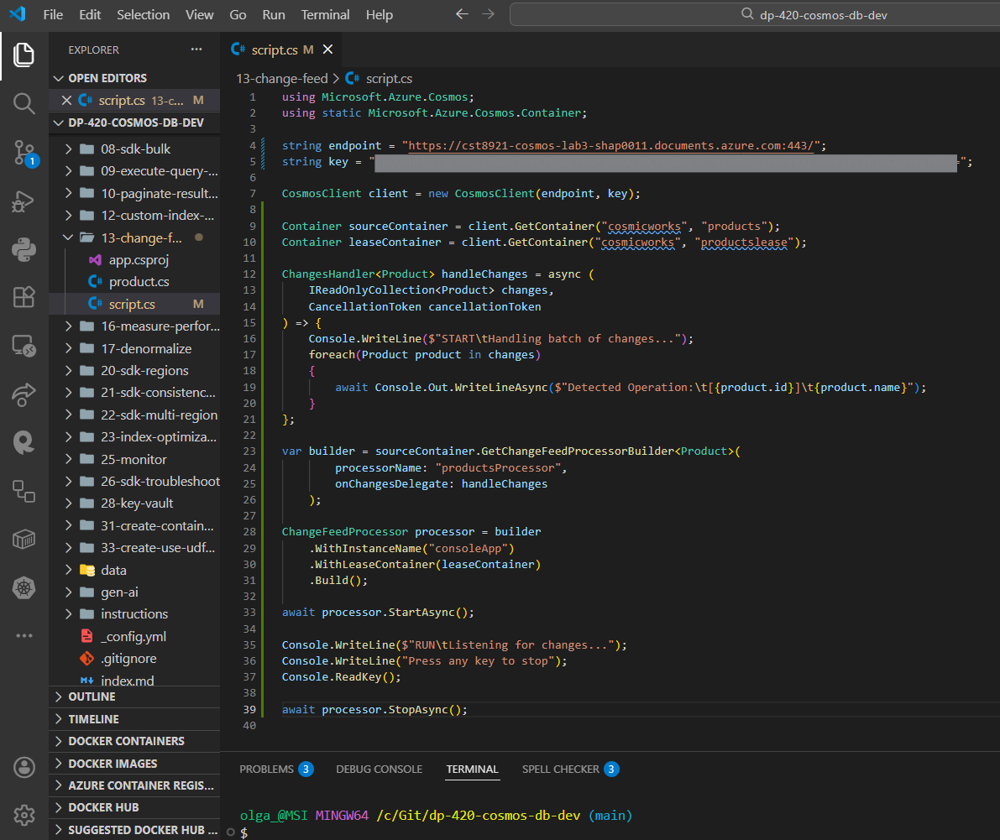
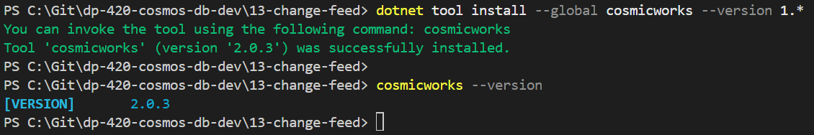
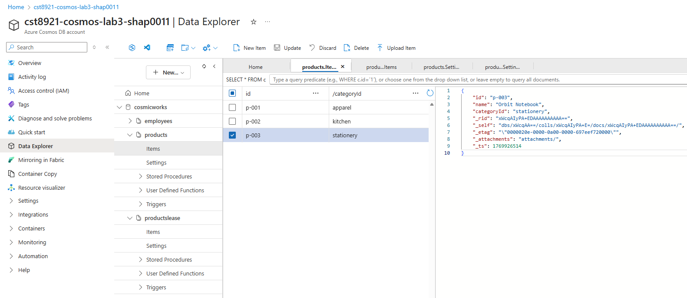
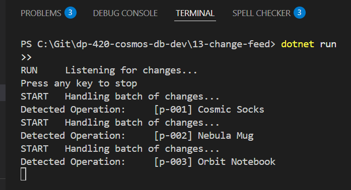
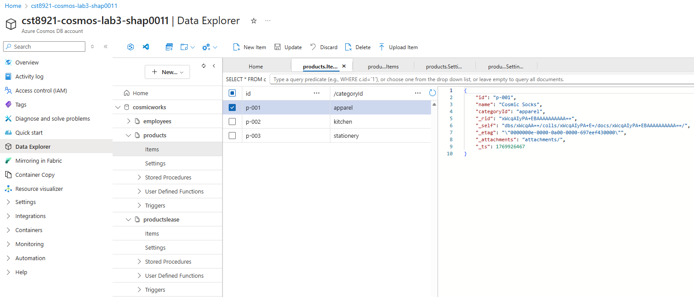
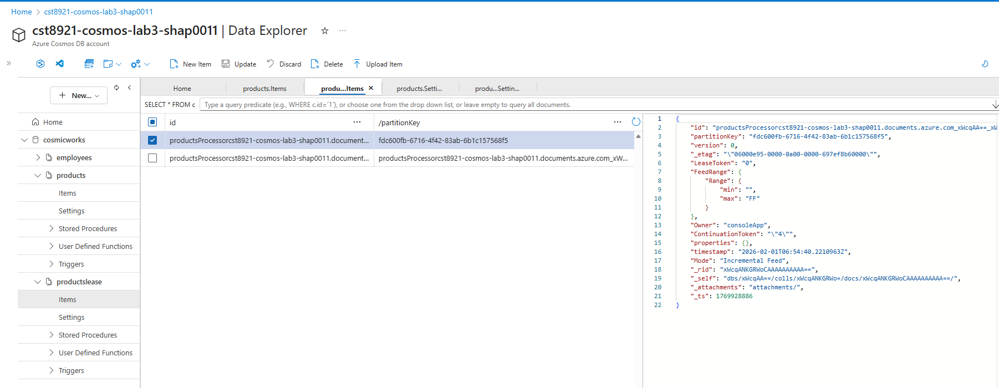

# CST8921 – Cloud Industry Trends

## Lab 3 – Cosmos db change feed

**Completed by: Olga Durham**
**St#: 040687883**

---

### Introduction

In this lab, students will explore and understand the capabilities of cosmosdb. Azure Cosmos DB is a fully-managed, globally-distributed, multi-model database. Databases in Cosmos DB are enterprise-ready and highly-available offering up to 99.999% availability SLA. In this Lab, you will learn how to manage Cosmos DB using the Azure Portal and Azure CLI as you integrate Azure Functions with Cosmos DB change feed triggers to buy and sell fictitious stocks. This lab uses the NoSQL API in Cosmos DB to work with a document database model.

Change feed in Azure Cosmos DB is a persistent record of changes to a container in the order they occur. Change feed support in Azure Cosmos DB works by listening to an Azure Cosmos DB container for any changes. It then outputs the sorted list of documents that were changed in the order in which they were modified. The persisted changes can be processed asynchronously and incrementally, and the output can be distributed across one or more consumers for parallel processing.

Upon on completion of this lab you will be able to:

- Understand the multi-model capabilities of Cosmos DB
- Understand the tradeoffs involved in deciding on a concurrency model and throughput level in Cosmos DB
- Connect to and work with NoSQL API Cosmos DB databases using the Azure Portal

---

### Objective

The goal of this lab activity is to familiarize students with the concepts, techniques and use cases of cosmos db change feed using Azure.

---

### Prerequisites

- Basic understanding of cloud hybrid concepts
- A computer with internet access
- Windows or mac machine
- Web browser
- Cloud portal access with any cloud service providers (AWS, Azure, GCP)

---

### Lab Activity Overview

#### Process change feed events using the Azure Cosmos DB for NoSQL SDK

In this lab, you will use the change feed processor functionality in the .NET SDK to create an application that is notified with a create or update operation is performed on an item in the specified container.

1. Start Visual Studio Code.
2. Open the command palette and run Git: Clone to clone the `https://github.com/microsoftlearning/dp-420-cosmos-db-dev` GitHub repository in a local folder of your choice.
3. Once the repository has been cloned, open the local folder you selected in Visual Studio Code.
4. Create an Azure Cosmos DB for noSQL account. Choose capacity mode as serverless.

    *Cosmos DB Overview*
    

5. Review keys pane in cosmosdb account and notice the connection details and credentials to connect the account from sdk.
6. In data explorer, expand new container and select new database.
7. In new database popup, enter “cosmicworks” value in database id.

    *Cosmos DB Database cosmicworks*<br>
    

8. In data explorer pane, select new container and enter following values:

    | Setting        | Value                           |
    |:---------------|:--------------------------------|
    | Database id    | *Use existing* \| *cosmicworks* |
    | Container id   | *products*                      |
    | Partition key  | */categoryId*                   |

    *Cosmos DB Container products*
        

9. Create another container with the following values:

    | Setting        | Value                           |
    |:---------------|:--------------------------------|
    | Database id    | *Use existing* \| *cosmicworks* |
    | Container id   | *productslease*                 |
    | Partition key  | */partitionKey*                 |

    *Cosmos DB Container products & productslease*
        

10. Return to visual studio.
11. In the Explorer pane, browse to the 13-change-feed folder.
12. Open the `product.cs` code file.
13. Observe the Product class and its corresponding properties. Specifically, this lab will use the id and name properties.
14. Back in the Explorer pane of Visual Studio Code, open the `script.cs` code file.
15. Update the existing variable named endpoint with its value set to the endpoint of the Azure Cosmos DB account you created earlier.
`string endpoint = "<cosmos-endpoint>";`

16. Update the existing variable named key with its value set to the key of the Azure Cosmos DB account you created earlier.
`string key = "<cosmos-key>";`

17. Use the `GetContainer` method of the client variable to retrieve the existing container using the name of the database (`cosmicworks`) and the name of the container (products) and store the result in a variable named `sourceContainer` of type Container:

`Container sourceContainer = client.GetContainer("cosmicworks", "products");`

18. Use the `GetContainer` method of the client variable to retrieve the existing container using the name of the database (`cosmicworks`) and the name of the container (`productslease`) and store the result in a variable named `leaseContainer` of type Container:

`Container leaseContainer = client.GetContainer("cosmicworks", "productslease");`

19.	Use this code and make the changes as per the instructions provided in previous steps:

```
using Microsoft.Azure.Cosmos;
using static Microsoft.Azure.Cosmos.Container;

string endpoint = "<cosmos-endpoint>";
string key = "<cosmos-key>";

CosmosClient client = new CosmosClient(endpoint, key);

Container sourceContainer = client.GetContainer("cosmicworks", "products");
Container leaseContainer = client.GetContainer("cosmicworks", "productslease");

ChangesHandler<Product> handleChanges = async (
    IReadOnlyCollection<Product> changes,
    CancellationToken cancellationToken
) => {
    Console.WriteLine($"START\tHandling batch of changes...");
    foreach(Product product in changes)
    {
        await Console.Out.WriteLineAsync($"Detected Operation:\t[{product.id}]\t{product.name}");
    }
};

var builder = sourceContainer.GetChangeFeedProcessorBuilder<Product>(
        processorName: "productsProcessor",
        onChangesDelegate: handleChanges
    );

ChangeFeedProcessor processor = builder
    .WithInstanceName("consoleApp")
    .WithLeaseContainer(leaseContainer)
    .Build();

await processor.StartAsync();

Console.WriteLine($"RUN\tListening for changes...");
Console.WriteLine("Press any key to stop");
Console.ReadKey();

await processor.StopAsync();
```

*Note : `ChangeHandler ()` will delegate to receive the changes within a `ChangeFeedProcessor` execution.*

20. Save the `script.cs` file.

    *Update script.cs code file*
        

21. In `Visual Studio Code`, open the context menu for the 13-change-feed folder and then select `Open` in `Integrated Terminal` to open a new terminal instance.
22.	Build and run the project using the dotnet run command:

```
dotnet run
```

23.	Leave both `Visual Studio Code` and the terminal open.
24.	Seed your `Azure Cosmos DB` for `NoSQL` account with sample data.
25.	You will use a command-line utility that creates a `cosmicworks` database and a `products` container. The tool will then create a set of items that you will observe using the change feed processor running in your terminal window.
26.	In `Visual Studio Code`, open the `Terminal` menu and then select `Split Terminal` to open a new terminal side by side with your existing instance.
27.	Install the `cosmicworks` command-line tool for *global* use on your machine.

```
dotnet tool install cosmicworks --global --version 1.*
```

The lab instructions specify installing the `cosmicworks` command-line tool using version `1.*`.
During execution, the latest available version of the tool (cosmicworks 2.0.3) was installed instead, as older 1.x versions are no longer available on NuGet.

The installation completed successfully; however, this version of the tool is not fully compatible with Azure Cosmos DB Serverless accounts.

*Terminal showing the tool installation*


28.	Run `cosmicworks` to seed your `Azure Cosmos DB` account with the following command-line options:

```
cosmicworks --endpoint <cosmos-endpoint> --key <cosmos-key> --datasets product
```

When using a Serverless Azure Cosmos DB account, the cosmicworks CLI (v2.x) attempts to read or modify throughput offers, which are not supported in serverless mode. This resulted in a 400 BadRequest error related to unsupported offer operations.

As a workaround, sample items were added manually using Azure Cosmos DB Data Explorer, which still triggers the Change Feed as expected.

29.	Manual data insertion (Serverless-compatible workaround)

To continue the lab and validate the Cosmos DB Change Feed functionality, three sample items were manually added to the `products` container using the Azure Portal Data Explorer.

This approach is fully compatible with serverless Cosmos DB accounts and still generates change feed events.

*Add three new items*
    

30.	Observe the terminal output from your `.NET` application. The terminal outputs a `Detected Operation` message for each change that was sent to it using the change feed.

While the Change Feed Processor was running using `dotnet run`, each inserted item triggered a change feed event. The terminal output confirmed that the processor successfully detected and processed the new items.

Each change was logged as a `Detected Operation`, validating that the Cosmos DB Change Feed was functioning correctly.

*Terminal showing the detected operations*<br>


31.	Close both integrated terminals.

32.	Verify the changes in `products` and `productlease` containers.

*DataExplorer products items*<br>


*DataExplorer productslease items*<br>


33.	Close `Visual Studio Code`.

#### Create an Azure Function app and Azure Cosmos DB-triggered function

1. Create an `Azure Cosmos DB` for `NoSQL` account. Use the `cosmos db` account created in the previous steps.
2. Create a Function App in Azure using the following configurations:

    | Setting          | Value                                               |
    |-----------------:|:----------------------------------------------------|
    | Subscription     | *Your existing Azure subscription*                  |
    | Resource group   | *Select an existing or create a new resource group* |
    | Name             | *Enter a globally unique name*                      |
    | Publish          | *Code*                                              |
    | Runtime stack    | *.NET*                                              |
    | Version          | *6*                                                 |
    | Region           | *Choose any available region*                       |
    | Storage account  | *Create a new storage account*                      |

3. Wait for the deployment task to complete before continuing with this task.
4. Go to the newly created Azure Functions account resource and navigate to the Functions pane.
5. In the Functions pane, select + Create.
6. In the Create function popup, create a new function with the following settings, leaving all remaining settings to their default values:

    | Setting                                       | Value                                    |
    |:----------------------------------------------|:----------------------------------------------------|
    | Development environment                       | Develop in portal             |
    | Select a template                             | Azure Cosmos DB trigger |
    | New Function                                  | `ItemsListener`                    |
    | Cosmos DB account connection                  | Select New \| Select Azure Cosmos DB  Account \| Select the Azure Cosmos DB  account you created earlier                                             |
    | Database name                                 | `cosmicworks`                                             |
    | Collection name                               | `products`                                                |
    | Collection name for leases                    | `productslease`                      |
    | Create lease collection if it does not exist  | No                     |

7. Implement function code in .net
8. In the `ItemsListener` | Function pane, navigate to the Code + Test pane.
9. In the editor for the `run.csx` script, delete the contents of the editor area.
10. Use the following code

```
#r "Microsoft.Azure.DocumentDB.Core"

using System;
using System.Collections.Generic;
using Microsoft.Azure.Documents;

public static void Run(IReadOnlyList<Document> input, ILogger log)
{
    log.LogInformation($"# Modified Items:\t{input?.Count ?? 0}");

    foreach(Document item in input)
    {
        log.LogInformation($"Detected Operation:\t{item.Id}");
    }
}
```

11. Expand the Logs section to connect to the streaming logs for the current function.
12. Save the current function code.
13. Observe the result of the C# code compilation. You should expect to see a Compilation succeeded message at the end of the log output.

14.	Maximize the log section to expand the output window to fill the maximum available space.
15.	You will use another tool to generate items in your `Azure Cosmos DB` for `NoSQL` container. Once you generate the items, you will return to this browser window to observe the output. Do not close the browser window prematurely.

16.	Seed your `Azure Cosmos DB` for `NoSQL` account with sample data
17.	You will use a command-line utility that creates a `cosmicworks` database and a products container. The tool will then create a set of items that you will observe using the change feed processor running in your terminal window.
18.	Start `Visual Studio Code`.

19.	In `Visual Studio Code`, open the `Terminal` menu and then select `New Terminal` to open a new terminal instance.
20.	Install the `[cosmicworks][nuget.org/packages/cosmicworks]` command-line tool for global use on your machine.

```
dotnet tool install cosmicworks --global --version 1.*
```

21.	Run `cosmicworks` to seed your `Azure Cosmos DB` account with the following command-line options:

| Option	----| Value |
|:--------------|:------|
| --endpoint    | The endpoint value you copied earlier in this lab |
| --key	        | The key value you coped earlier in this lab |
| --datasets    | product |

```
cosmicworks --endpoint <cosmos-endpoint> --key <cosmos-key> --datasets product
```

22.	Wait for the `cosmicworks` command to finish populating the account with a database, container, and items.

23.	Close the integrated terminal.

24.	Close `Visual Studio Code`.

25.	Return to the currently open browser window or tab with the `Azure Functions` log section expanded.

26.	Observe the log output from your function. The terminal outputs a Detected Operation message for each change that was sent to it using the change feed. The operations are batched into groups of ~100 operations.

27.	Close your web browser window or tab.

28.	Delete all the resources after completing the lab and document all the steps in the lab report with the screenshots.

---

### Important Notes

For grading prepare a lab report with your findings and analysis and share that in an Assignments tab in Brightspace.


