# CST8921 – Cloud Industry Trends

## Lab 4 – Azure Databricks and analyzing files with databricks

**Completed by: Olga Durham**
**St#: 040687883**

---

### Introduction

Azure Databricks is an analytics platform powered by Apache Spark. Spark is a unified analytics engine capable of working with virtually every major database, data caching service, and data warehouse provider.\
In Databricks you have the option of working with Spark, Scala, and Python to manage, analyze, and visualize data. Notebooks in Databricks clusters provide the ability to programmatically interact with data from virtually any major data source.\
The goal is to be able to experiment and learn with little start time or overhead. Feel free to experiment with loading data to ADLS, managing data and folders in ADLS using Databricks, working with Databricks clusters and notebooks, and more. 

### Objective

In this lab, you will explore raw data stored in Azure Data Lake Storage, transform it using Apache Spark, and load the refined data into an analytics store for querying.

### Prerequisites

- An active Azure subscription or sandbox
- Azure Storage Account with Hierarchical Namespace enabled (ADLS Gen2)
- Azure Synapse Analytics workspace OR Azure Databricks workspace
- Basic knowledge of SQL and Python

---

### Important Lab4 Notes README

E-commerce Synthetic Dataset (DP-203 Lab)

Folder: raw_parquet/

Files:
1) customers.parquet
   Columns: customer_id (string), country (string), signup_date (date)
   Rows: 50,000

2) orders.parquet
   Columns: order_id (string), customer_id (string), order_date (timestamp), order_amount (double), order_status (string)
   Rows: 202,000  (includes ~1% duplicates)

3) order_events.parquet
   Columns: event_id (string), order_id (string), event_time (timestamp), event_type (string)
   Rows: 422,100  (includes ~0.5% duplicates)

Notes:
- signup_date range: 2022-01-01 to 2025-12-31
- order_date range:  2023-01-01 to 2025-12-31
- event_time occurs within 0-7 days after the related order_date
- Designed for: ADLS Gen2 -> Spark transforms -> Synapse Serverless SQL exploration.

Suggested student exercises:
- Deduplicate orders/events
- Add Year/Month columns
- Partition refined outputs by Year/Month
- Analytics: revenue by Year; top countries by revenue; event counts by type

---

<div style="page-break-after: always;"></div>

### Lab Activity Overview

#### Part 1

##### Step 1: Upload Data to Azure Data Lake

1. Sign in to the Azure Portal
2. Navigate to your Storage Account

*Figure 1: Storage Account Created*
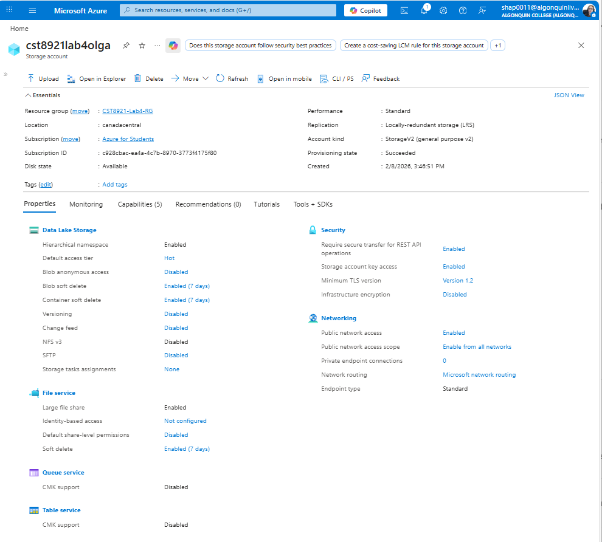

<div style="page-break-after: always;"></div>

3. Open Containers
4. Create a container named: `raw`
5. Upload the provided sample dataset in weekly lab 4 files into
    - `raw/customers/customers.parquet`
    - `raw/orders/orders.parquet`
    - `raw/order_events/order_events.parquet`

*Figure 2: File customers.parquet added*
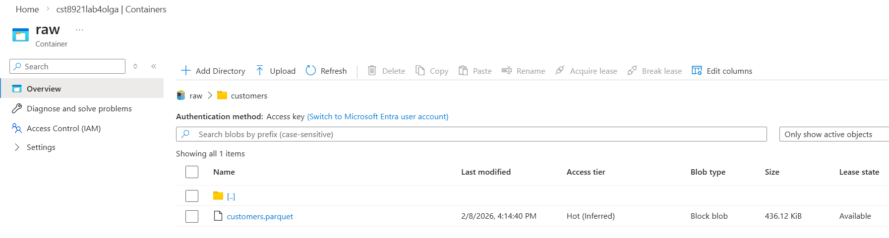

*Figure 3: File customers.parquet added*
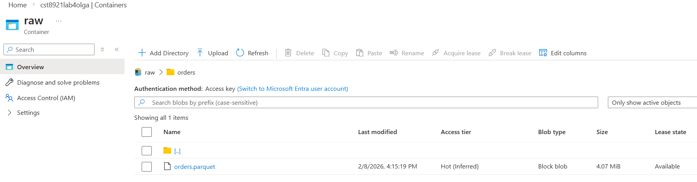

*Figure 4: File customers.parquet added*
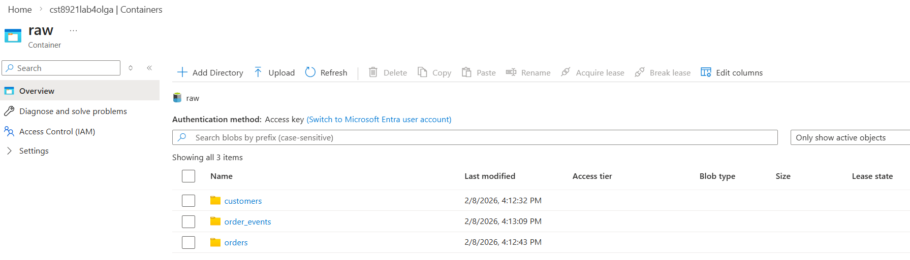

<div style="page-break-after: always;"></div>

##### Step 2: Explore Data using Serverless SQL

1. Open Azure Synapse Studio

*Figure 5: Synapse workspace created*
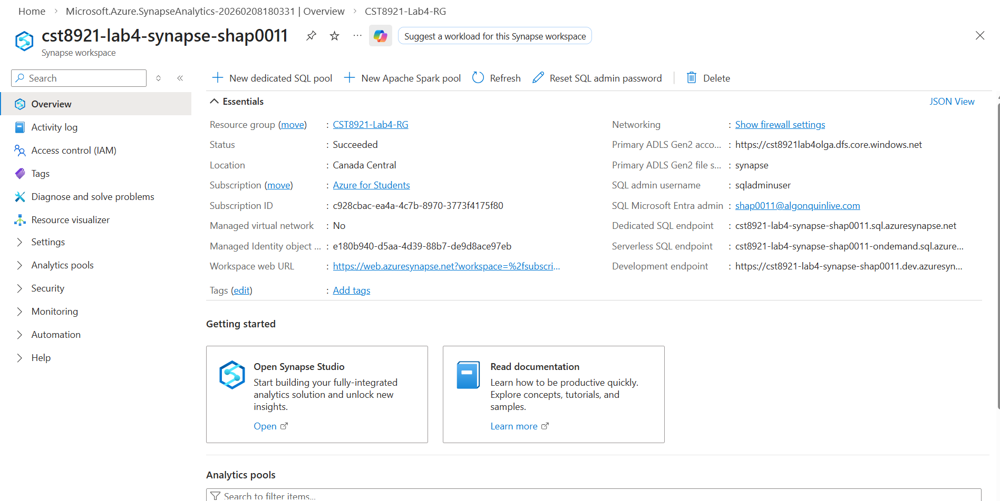

2. Navigate to Develop → SQL script
3. Run the following query to explore Parquet files directly from the Data Lake:

```
SELECT TOP 100 *
FROM OPENROWSET(
    BULK 'https://cst8921lab4olga.dfs.core.windows.net/raw/*/*.parquet',
    FORMAT = 'PARQUET'
) AS rows;

```

4. Observe: Column names, Data types, Sample records

*Figure 6: Explore Parquet files directly from the Data Lake*
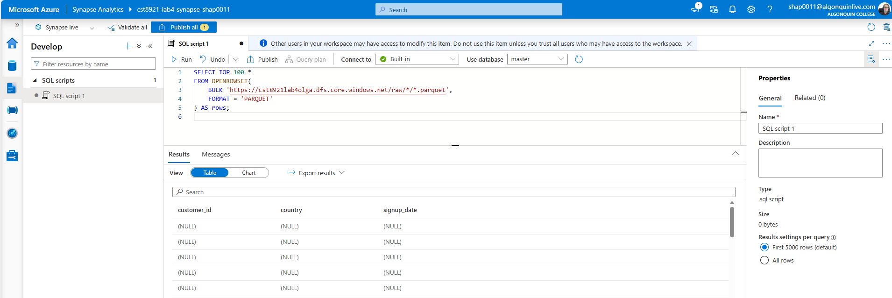

*Figure 7: Explore Customers Parquet file directly from the Data Lake*
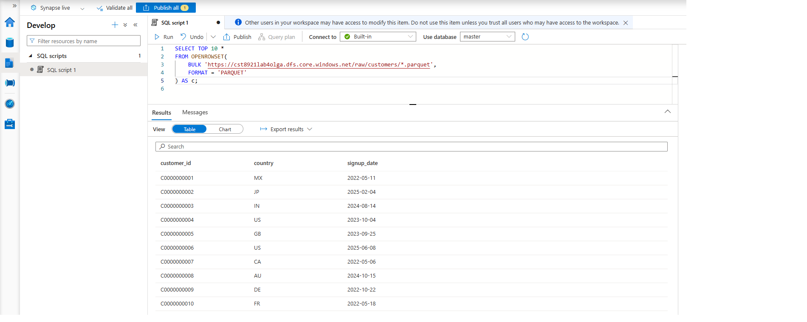

*Figure 8: Explore Orders Parquet file directly from the Data Lake*
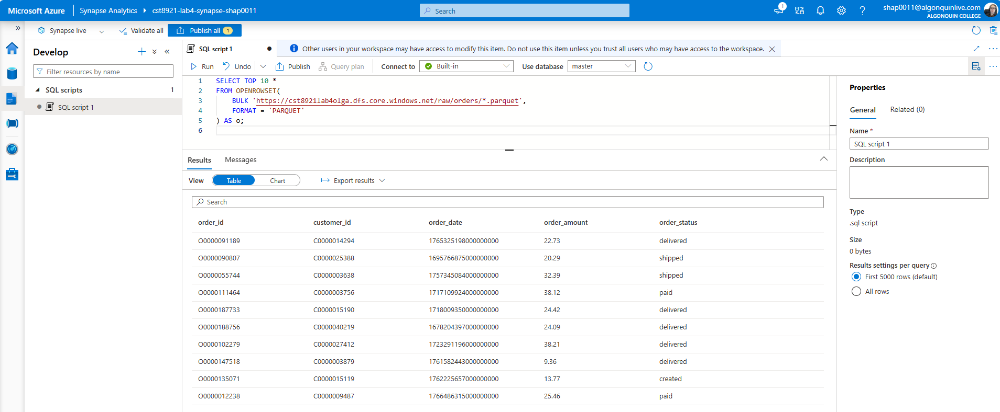

*Figure 9: Explore Order Events Parquet file directly from the Data Lake*
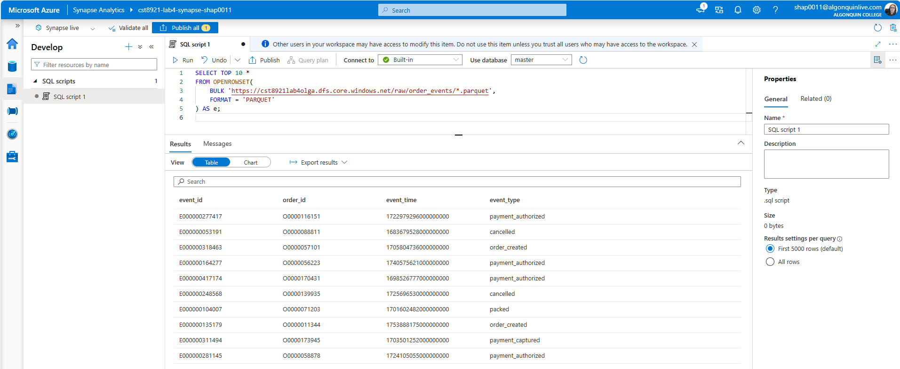

<div style="page-break-after: always;"></div>

5. Try adding a filter: `WHERE Year > 2022`

```
SELECT TOP 10 *
FROM OPENROWSET(
    BULK 'https://cst8921lab4olga.dfs.core.windows.net/raw/customers/*.parquet',
    FORMAT = 'PARQUET'
) AS cgr
WHERE YEAR(signup_date) > 2022;

```

*Figure 10: Explore Customers Parquet file directly from the Data Lake where year > 2022*
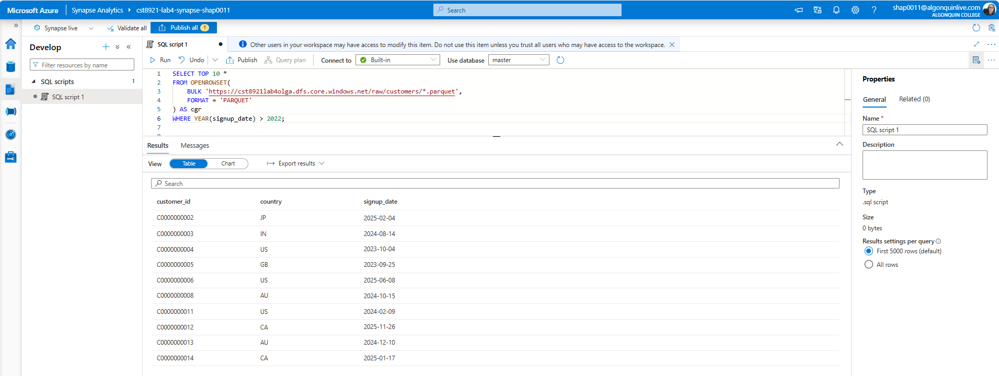

```
SELECT TOP 10 *,
       DATEADD(
           SECOND,
           CAST(order_date / 1000000000 AS BIGINT),
           '1970-01-01'
       ) AS order_datetime
FROM OPENROWSET(
    BULK 'https://cst8921lab4olga.dfs.core.windows.net/raw/orders/*.parquet',
    FORMAT = 'PARQUET'
) AS ogr2022
WHERE YEAR(
    DATEADD(
        SECOND,
        CAST(order_date / 1000000000 AS BIGINT),
        '1970-01-01'
    )
) > 2022;

```

*Figure 11: Explore Orders Parquet file directly from the Data Lake where year > 2022*
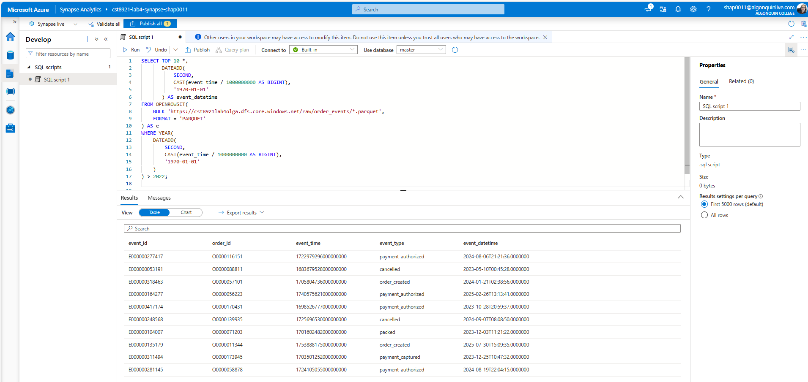

```
SELECT TOP 10 *,
       DATEADD(
           SECOND,
           CAST(event_time / 1000000000 AS BIGINT),
           '1970-01-01'
       ) AS event_datetime
FROM OPENROWSET(
    BULK 'https://cst8921lab4olga.dfs.core.windows.net/raw/order_events/*.parquet',
    FORMAT = 'PARQUET'
) AS e
WHERE YEAR(
    DATEADD(
        SECOND,
        CAST(event_time / 1000000000 AS BIGINT),
        '1970-01-01'
    )
) > 2022;

```

*Figure 12: Explore Order Events Parquet file directly from the Data Lake where year > 2022*


##### Step 3: Explore Data using Spark Notebook

1. In Synapse Studio, go to Develop → Notebooks
2. Create a new Spark Notebook
3. Select Python as the language

*Figure 13: Created Apache Spark pool*
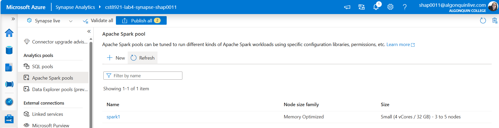

4. Load the data:

```
df = spark.read.parquet(
    "abfss://raw@cst8921lab4olga.dfs.core.windows.net/*/*.parquet"
)

```

*Figure 14: Load the data*
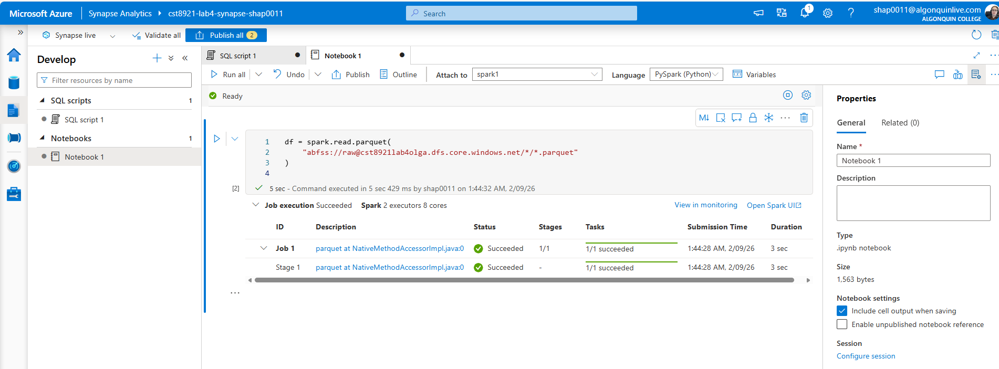

5. Inspect the data: 

```
df.printSchema()

```

*Figure 15: Inspect the data; print schema*\
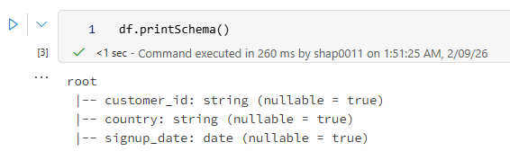

```

df.show(5)

```

*Figure 16: Inspect the data; show five rows*\
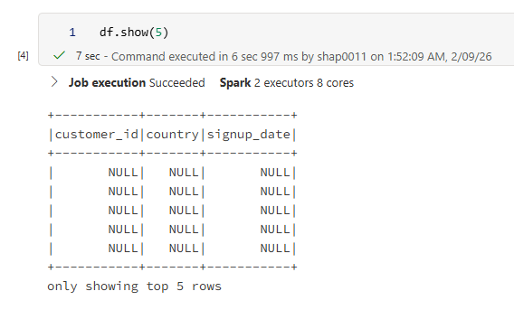

I loaded multiple Parquet files with different schemas using a wildcard. Spark inferred a schema (it picked the customers schema), and when it reads rows from orders/events, those customer columns don’t exist → they show up as NULL.

To “inspect the data” properly, we should load each dataset separately (this also makes Part 2 easier).

```
df_customers = spark.read.parquet("abfss://raw@cst8921lab4olga.dfs.core.windows.net/customers/customers.parquet")

df_customer.printSchema()
df_customers.show(5)

```

*Figure 17: Inspect the customers data*
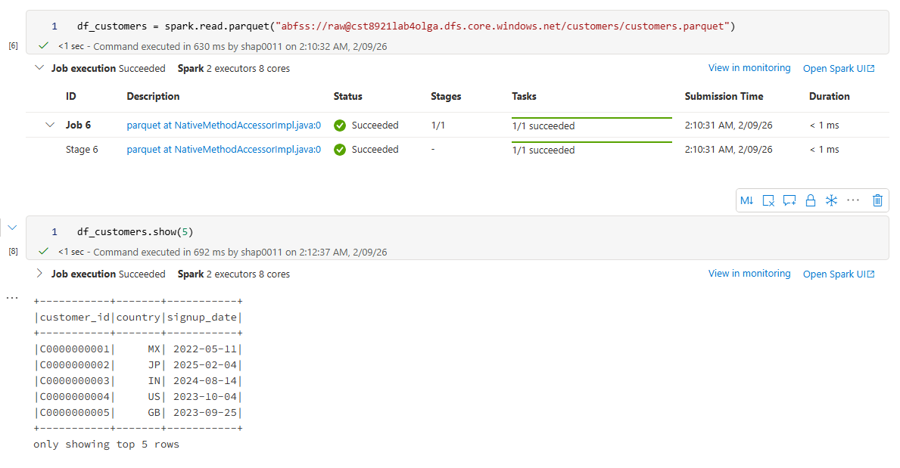

```
df_orders = spark.read.parquet("abfss://raw@cst8921lab4olga.dfs.core.windows.net/orders/orders.parquet")

```

This code gave an error: `Illegal Parquet type: INT64 (TIMESTAMP(NANOS,false))`

That means the orders.parquet file stores order_date as a nanosecond timestamp, and the Spark version behind the Synapse pool can’t read TIMESTAMP(NANOS) directly.

To fix it we have to tell Spark to read that column as INT64, then we’ll convert it ourselves (which also matches the earlier Serverless SQL work).

**Read with binaryAsString/schema override (safe approach)**

```
from pyspark.sql.types import StructType, StructField, StringType, LongType, DoubleType

orders_schema = StructType([
    StructField("order_id", StringType(), True),
    StructField("customer_id", StringType(), True),
    StructField("order_date", LongType(), True),        # force as long (epoch nanos)
    StructField("order_amount", DoubleType(), True),
    StructField("order_status", StringType(), True),
])

df_orders = spark.read.schema(orders_schema).parquet(
    "abfss://raw@cst8921lab4olga.dfs.core.windows.net/orders/orders.parquet"
)

df_orders.printSchema()
df_orders.show(5)

```

*Figure 18: Inspect the orders data*\
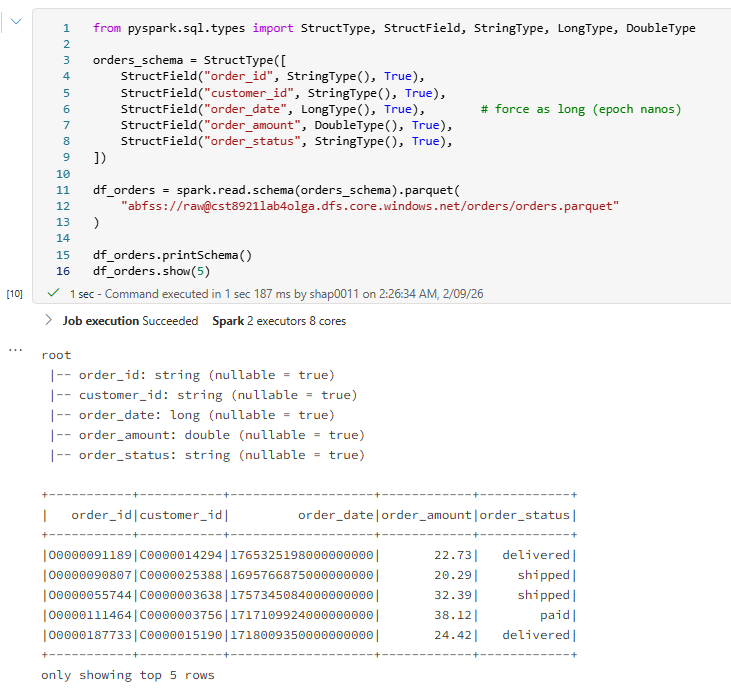

**What this does:**
- Forces Spark to **not interpret** the Parquet nanos timestamp as a Spark timestamp
- Reads it as a plain number (`long`) so we can convert it safely

**Turn nanos into a real timestamp**

```
from pyspark.sql.functions import col, from_unixtime, to_timestamp

df_orders = df_orders.withColumn(
    "order_datetime",
    to_timestamp(from_unixtime((col("order_date") / 1_000_000_000).cast("long")))
)

df_orders.select("order_id", "customer_id", "order_date", "order_datetime", "order_amount", "order_status").show(5, truncate=False)

```

*Figure 19: Inspect the orders data*
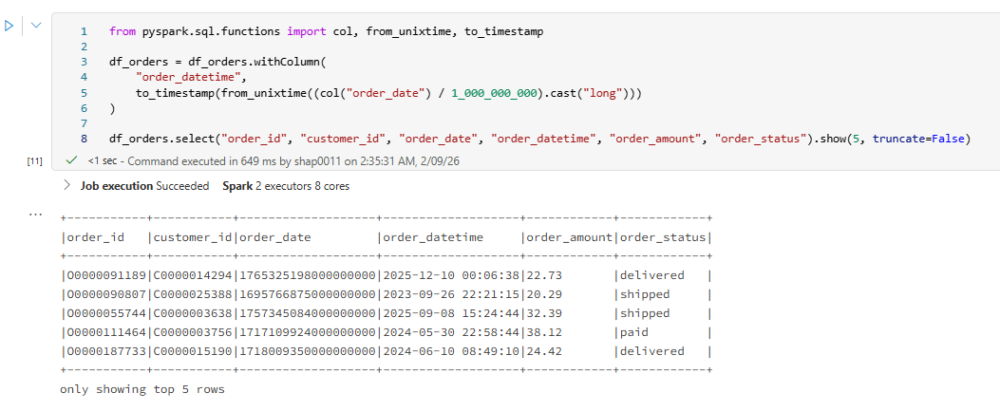

```
from pyspark.sql.types import StructType, StructField, StringType, LongType

events_schema = StructType([
    StructField("event_id", StringType(), True),
    StructField("order_id", StringType(), True),
    StructField("event_time", LongType(), True),   # epoch nanos
    StructField("event_type", StringType(), True),
])

df_events = spark.read.schema(events_schema).parquet(
    "abfss://raw@cst8921lab4olga.dfs.core.windows.net/order_events/order_events.parquet"
)

from pyspark.sql.functions import col, from_unixtime, to_timestamp

df_events = df_events.withColumn(
    "event_datetime",
    to_timestamp(from_unixtime((col("event_time") / 1_000_000_000).cast("long")))
)

df_events.printSchema()
df_events.select("event_id","order_id","event_time","event_datetime","event_type").show(5, truncate=False)

```

*Figure 20: Inspect the orders data*
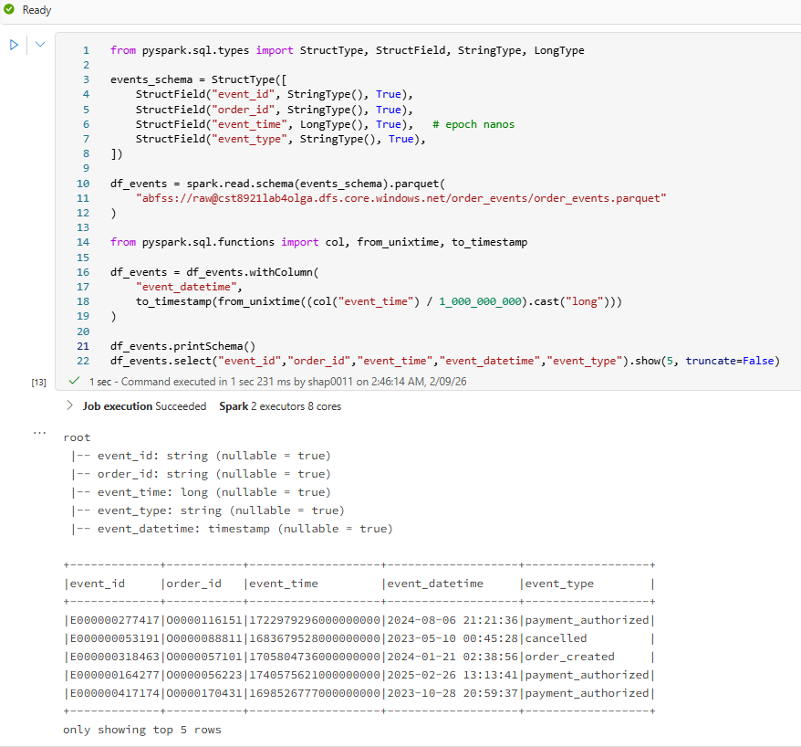

---

#### PART 2: Data Transformation using Spark 

##### Step 4

1. Remove Duplicates : Remove duplicate records:

**Load Orders + Events**

```
from pyspark.sql.types import StructType, StructField, StringType, LongType, DoubleType

orders_schema = StructType([
    StructField("order_id", StringType(), True),
    StructField("customer_id", StringType(), True),
    StructField("order_date", LongType(), True),        # epoch nanos
    StructField("order_amount", DoubleType(), True),
    StructField("order_status", StringType(), True),
])

events_schema = StructType([
    StructField("event_id", StringType(), True),
    StructField("order_id", StringType(), True),
    StructField("event_time", LongType(), True),        # epoch nanos
    StructField("event_type", StringType(), True),
])

df_orders = spark.read.schema(orders_schema).parquet(
    "abfss://raw@cst8921lab4olga.dfs.core.windows.net/orders/orders.parquet"
)

df_events = spark.read.schema(events_schema).parquet(
    "abfss://raw@cst8921lab4olga.dfs.core.windows.net/order_events/order_events.parquet"
)

```

**Remove duplicates**

```
df_orders_dedup = df_orders.dropDuplicates()
df_events_dedup = df_events.dropDuplicates()

```

*Figure 21: Remove duplicates*\
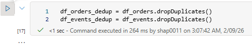

2. Verify record count (before vs after):

```
print("Orders - before:", df_orders.count())
print("Orders - after :", df_orders_dedup.count())

print("Events - before:", df_events.count())
print("Events - after :", df_events_dedup.count())

```

*Figure 22: Verify record count*\
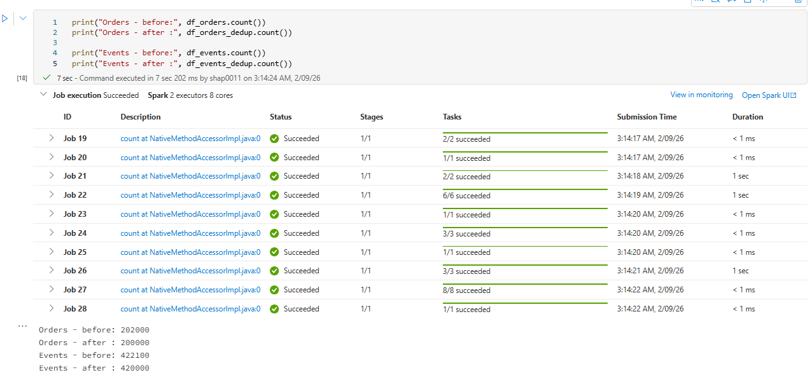

##### Step 5: Fix Data Types 

Recreate `df_orders` (After Synapse Studio was stopped for a few hours)

```
from pyspark.sql.types import StructType, StructField, StringType, LongType, DoubleType

orders_schema = StructType([
    StructField("order_id", StringType(), True),
    StructField("customer_id", StringType(), True),
    StructField("order_date", LongType(), True),   # epoch nanoseconds
    StructField("order_amount", DoubleType(), True),
    StructField("order_status", StringType(), True),
])

df_orders = spark.read.schema(orders_schema).parquet(
    "abfss://raw@cst8921lab4olga.dfs.core.windows.net/orders/orders.parquet"
)

```

Recreate `df_orders_dedup`

```
df_orders_dedup = df_orders.dropDuplicates()

```

Sanity check

```
print(df_orders.count(), df_orders_dedup.count())

```

*Figure 23: Recreate df_orders and df_orders_dedup after the Synapse Studio being offline*\
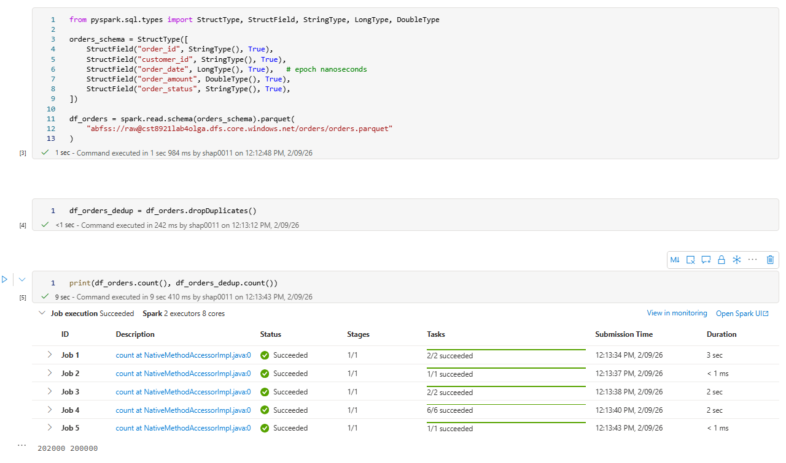

1. Convert order_date (nanos) → proper timestamp:

```
from pyspark.sql.functions import col, from_unixtime, to_timestamp

df_orders_clean = df_orders_dedup.withColumn(
    "order_date",
    to_timestamp(from_unixtime((col("order_date") / 1_000_000_000).cast("long")))
)

```

This overwrites order_date into a true Spark timestamp.

2. Verify schema:

```
df_orders_clean.printSchema()
df_orders_clean.show(5, truncate=False)

```

*Figure 24: Overwrite order_date into a true Spark timestamp & verify schema*\
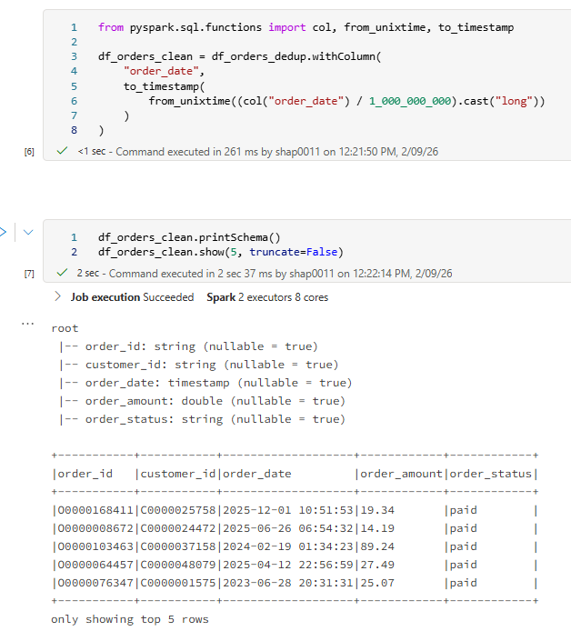

##### Step 6: Create Derived Columns 

1.	Rebuild the Orders pipeline in one clean sequence

```
from pyspark.sql.types import StructType, StructField, StringType, LongType, DoubleType
from pyspark.sql.functions import col, from_unixtime, to_timestamp, year, month

# 1. Read orders with safe schema
orders_schema = StructType([
    StructField("order_id", StringType(), True),
    StructField("customer_id", StringType(), True),
    StructField("order_date", LongType(), True),   # epoch nanoseconds
    StructField("order_amount", DoubleType(), True),
    StructField("order_status", StringType(), True),
])

df_orders = spark.read.schema(orders_schema).parquet(
    "abfss://raw@cst8921lab4olga.dfs.core.windows.net/orders/orders.parquet"
)

# 2. Deduplicate
df_orders_dedup = df_orders.dropDuplicates()

# 3. Fix data type (nanos -> timestamp)
df_orders_clean = df_orders_dedup.withColumn(
    "order_date",
    to_timestamp(from_unixtime((col("order_date") / 1_000_000_000).cast("long")))
)

# 4. Create derived columns
df_orders_transformed = (
    df_orders_clean
    .withColumn("Year", year("order_date"))
    .withColumn("Month", month("order_date"))
)

```

2. Verify

```
df_orders_transformed.select(
    "order_id", "order_date", "Year", "Month", "order_amount", "order_status"
).show(5, truncate=False)

```

*Figure 25: Create derived columns*\
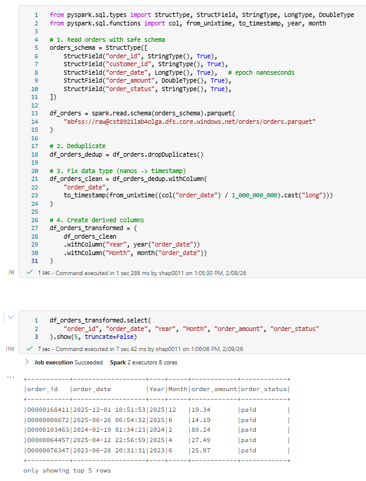

##### Step 7: Write Transformed Data to Refined Zone

1. Create a new container named: `refined`

*Figure 26: Create storage container `refined`*\
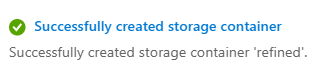

2. Write orders to refined zone:

```
df_orders_transformed.write.mode("overwrite").parquet(
    "abfss://refined@cst8921lab4olga.dfs.core.windows.net/orders"
)

```

*Figure 27: Write Orders to refined zone*\
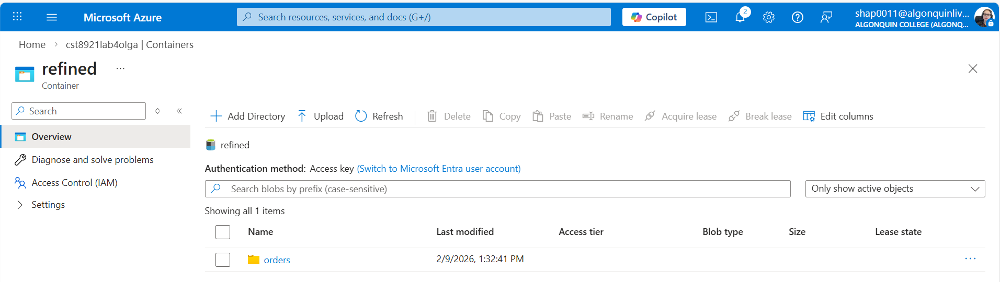

3. Write Events to refined zone

Create transformed events dataframe

```
from pyspark.sql.types import StructType, StructField, StringType, LongType
from pyspark.sql.functions import col, from_unixtime, to_timestamp, year, month

events_schema = StructType([
    StructField("event_id", StringType(), True),
    StructField("order_id", StringType(), True),
    StructField("event_time", LongType(), True),
    StructField("event_type", StringType(), True),
])

df_events = spark.read.schema(events_schema).parquet(
    "abfss://raw@cst8921lab4olga.dfs.core.windows.net/order_events/order_events.parquet"
)

df_events_transformed = (
    df_events
    .dropDuplicates()
    .withColumn(
        "event_time",
        to_timestamp(from_unixtime((col("event_time") / 1_000_000_000).cast("long")))
    )
    .withColumn("Year", year("event_time"))
    .withColumn("Month", month("event_time"))
)

```

Write events to refined zone

```
df_events_transformed.write.mode("overwrite").parquet(
    "abfss://refined@cst8921lab4olga.dfs.core.windows.net/order_events"
)

```

*Figure 28: Write Events to refined zone*\
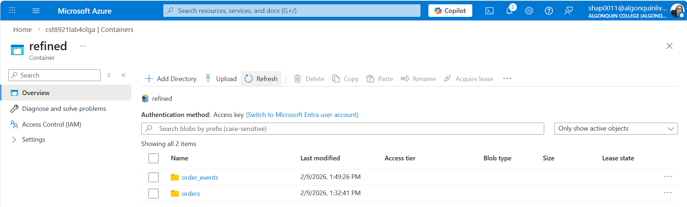

---

#### PART 3: Load & Analyze Data

##### Step 8: Create External Table using SQL

1. Open a Serverless SQL script
2. Query refined orders directly (validation)

```
SELECT TOP 10 *
FROM OPENROWSET(
    BULK 'https://cst8921lab4olga.dfs.core.windows.net/refined/orders/*.parquet',
    FORMAT = 'PARQUET'
) AS o;

```

*Figure 29: Query refined orders directly (validation)*\
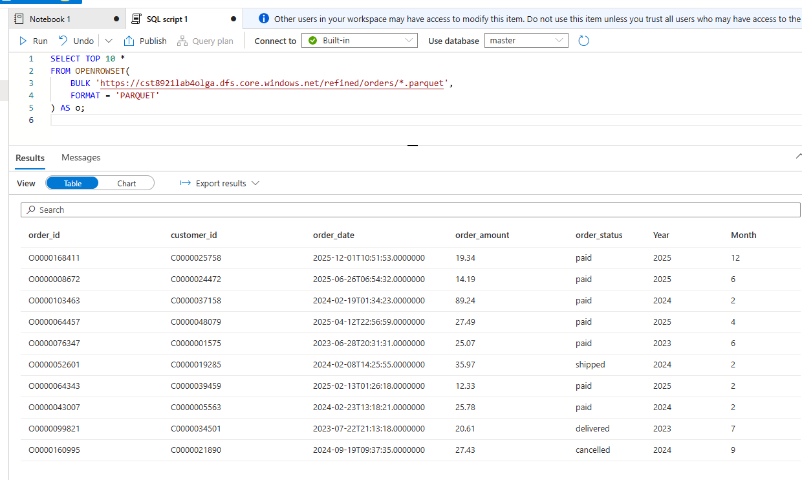

3. Create SQL “external table” objects (Views):

Create a user database

```
CREATE DATABASE Lab4DB;

```

Switch to the new database

```
USE Lab4DB;

```

Create a view for refined orders

```
CREATE VIEW refined_orders AS
SELECT *
FROM OPENROWSET(
    BULK 'https://cst8921lab4olga.dfs.core.windows.net/refined/orders/*.parquet',
    FORMAT = 'PARQUET'
) AS o;

```

```
SELECT TOP 10 * 
FROM refined_orders;

```

Create a view for refined order events

```
CREATE VIEW refined_order_events AS
SELECT *
FROM OPENROWSET(
    BULK 'https://cst8921lab4olga.dfs.core.windows.net/refined/order_events/*.parquet',
    FORMAT = 'PARQUET'
) AS e;

```

```
SELECT Year, COUNT(*) AS total_events
FROM refined_order_events
GROUP BY Year
ORDER BY Year;

```

Query the table

*Figure 30: Serverless SQL query showing total order events grouped by year*\
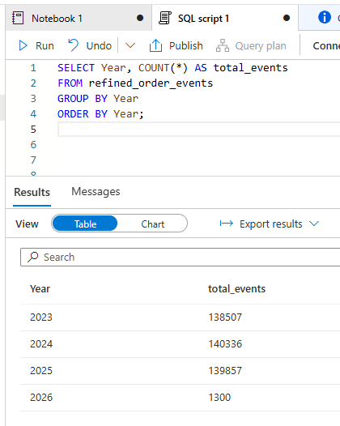

##### Step 9: Analyze & Visualize Data 

1. Notebook Visualization

Rebuild the Events pipeline

```
from pyspark.sql.types import StructType, StructField, StringType, LongType
from pyspark.sql.functions import col, from_unixtime, to_timestamp, year, month

# 1. Read order_events with safe schema
events_schema = StructType([
    StructField("event_id", StringType(), True),
    StructField("order_id", StringType(), True),
    StructField("event_time", LongType(), True),   # epoch nanoseconds
    StructField("event_type", StringType(), True),
])

df_events = spark.read.schema(events_schema).parquet(
    "abfss://raw@cst8921lab4olga.dfs.core.windows.net/order_events/order_events.parquet"
)

# 2. Deduplicate
df_events_dedup = df_events.dropDuplicates()

# 3. Fix data type (nanos -> timestamp)
df_events_clean = df_events_dedup.withColumn(
    "event_time",
    to_timestamp(from_unixtime((col("event_time") / 1_000_000_000).cast("long")))
)

# 4. Create derived columns
df_events_transformed = (
    df_events_clean
    .withColumn("Year", year("event_time"))
    .withColumn("Month", month("event_time"))
)

```

Events by Year

```
df_events_transformed.groupBy("Year").count().orderBy("Year").show()

```

*Figure 31: Spark notebook aggregation showing total order events grouped by year*\
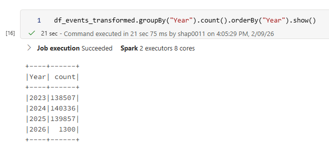

Orders by Year

Recreate `df_orders_transformed`

```
from pyspark.sql.types import StructType, StructField, StringType, LongType, DoubleType
from pyspark.sql.functions import col, from_unixtime, to_timestamp, year, month

# 1) Read orders with safe schema (order_date stored as epoch nanoseconds)
orders_schema = StructType([
    StructField("order_id", StringType(), True),
    StructField("customer_id", StringType(), True),
    StructField("order_date", LongType(), True),   # epoch nanos
    StructField("order_amount", DoubleType(), True),
    StructField("order_status", StringType(), True),
])

df_orders = spark.read.schema(orders_schema).parquet(
    "abfss://raw@cst8921lab4olga.dfs.core.windows.net/orders/orders.parquet"
)

# 2) Deduplicate
df_orders_dedup = df_orders.dropDuplicates()

# 3) Fix data type (nanos -> timestamp)
df_orders_clean = df_orders_dedup.withColumn(
    "order_date",
    to_timestamp(from_unixtime((col("order_date") / 1_000_000_000).cast("long")))
)

# 4) Derived columns
df_orders_transformed = (
    df_orders_clean
    .withColumn("Year", year("order_date"))
    .withColumn("Month", month("order_date"))
)

```

Query Orders by Year

```
df_orders_transformed.groupBy("Year").count().orderBy("Year").show()

```

*Figure 32: Spark notebook aggregation showing total orders grouped by year*\
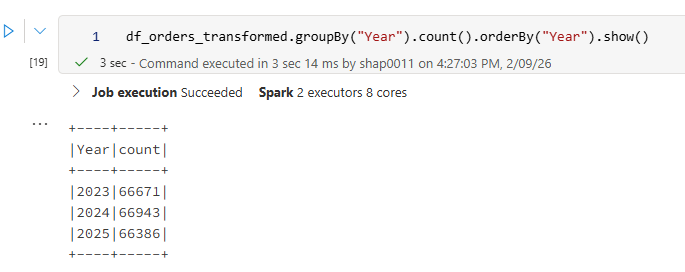


##### Step 10: Clean all the resources created during this lab

After completing the lab activities, all Azure resources created for this lab were cleaned up to avoid unnecessary costs. The resource group containing the Azure Synapse workspace, Apache Spark pool, and Azure Data Lake Storage Gen2 account was deleted. This ensured that no active compute or storage resources remained after the lab was completed.

*Figure 33: Deleting Azure resources created for Lab 4 to prevent ongoing charges*\
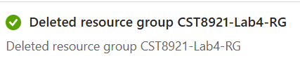


---

### Findings

During this lab, raw e-commerce data stored in Azure Data Lake Storage Gen2 was successfully explored, transformed, and analyzed using Azure Synapse Analytics and Apache Spark. Serverless SQL queries confirmed that Parquet files could be queried directly from the data lake without requiring prior ingestion, demonstrating the flexibility of schema-on-read in cloud-based analytics.

While exploring the raw datasets, it was observed that the orders and order_events files contained duplicate records, which aligned with the dataset documentation. Apache Spark was used to remove these duplicates efficiently. Additionally, timestamp fields in the orders and order events datasets were stored as Unix epoch values in nanoseconds, requiring explicit conversion to proper timestamp data types before meaningful time-based analysis could be performed.

After cleaning and transforming the data, new derived columns (**Year** and **Month**) were added to support analytical queries. The transformed datasets were written to a refined zone in Azure Data Lake Storage, following a common data lake architecture pattern that separates raw and curated data.

Using Synapse Serverless SQL, refined data was successfully queried through external SQL views, enabling aggregation and analysis without copying data into a dedicated database. Aggregation results showed how order events were distributed across multiple years, demonstrating the ability to analyze large datasets efficiently using cloud-native tools.

---

### Conclusion

This lab demonstrated an end-to-end cloud analytics workflow using Azure-native services. Azure Data Lake Storage Gen2 provided scalable and cost-effective storage for raw and refined data, while Azure Synapse Analytics enabled both SQL-based exploration and Spark-based data processing within a single platform.

Apache Spark proved effective for handling large datasets, removing duplicates, converting complex timestamp formats, and generating derived analytical attributes. Serverless SQL complemented Spark processing by enabling ad-hoc querying and analysis directly on refined Parquet files without requiring additional infrastructure.

Overall, this lab highlighted the advantages of a modern cloud analytics architecture, including flexibility, scalability, and reduced operational overhead. The ability to combine Spark-based transformations with Serverless SQL analytics allows organizations to efficiently process and analyze large volumes of data while minimizing cost and complexity.

This lab reinforced the importance of proper data cleaning, schema management, and separation of raw and refined data zones when building scalable cloud analytics solutions.

