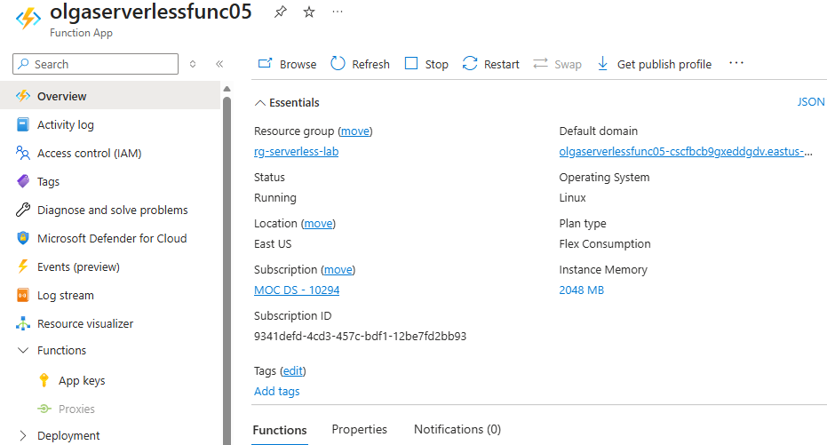
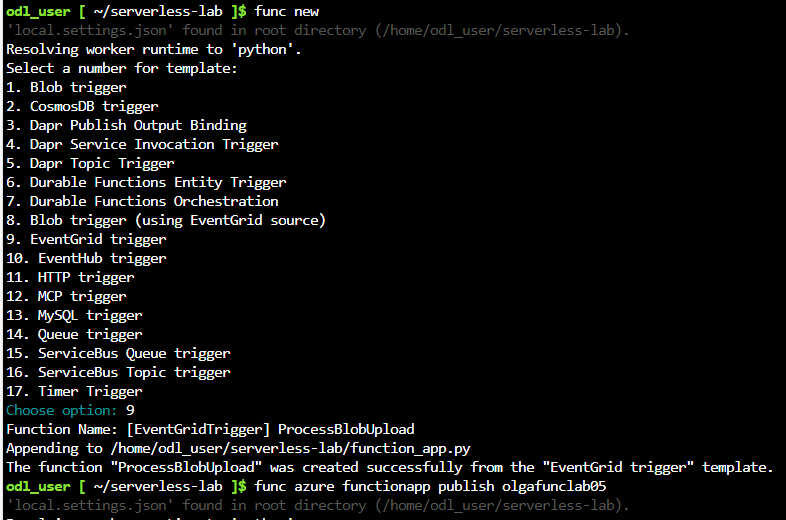
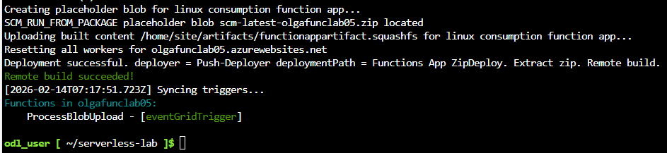
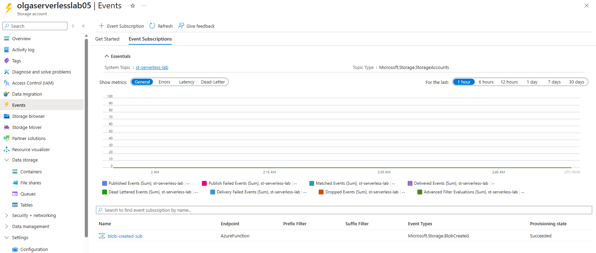
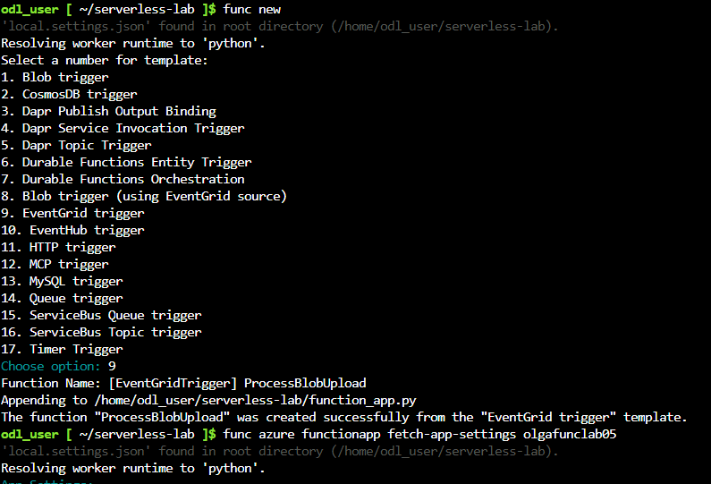
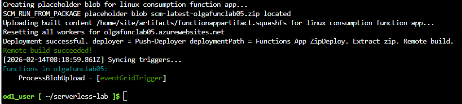
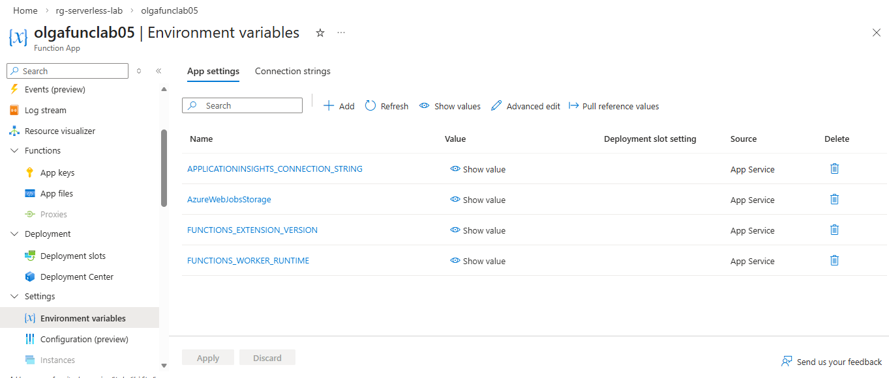
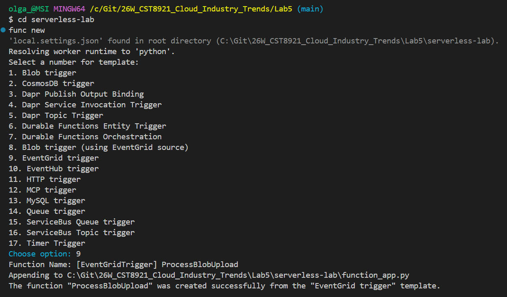
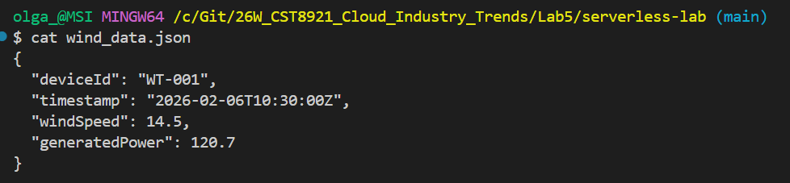
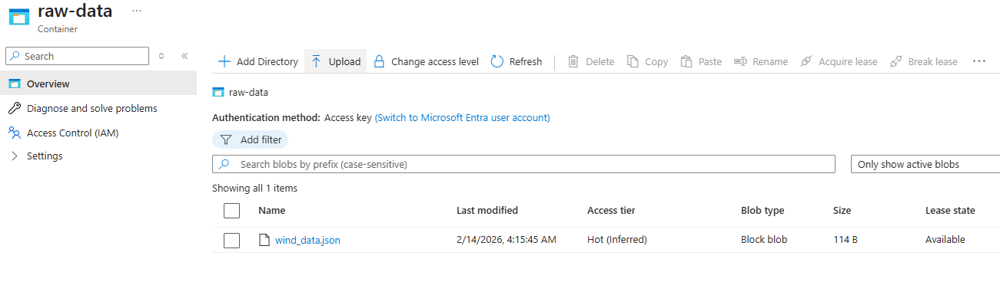

# CST8921 – Cloud Industry Trends

## Lab 5 – Serverless Computing

**Completed by: Olga Durham**
**St#: 040687883**

---

### Introduction

In this lab, students will gain hands-on experience in building and managing serverless framework. They will learn how to deploy first serverless microservice in cloud.

Serverless computing is one of the most interesting and useful parts the cloud offers. It allows engineers to design and code their applications, and then execute them without worrying about the underlying server infrastructure. One of the most famous paradigms Serverless computing introduced is the FaaS (Function as a Service). That means you focus more on single tasks and functions, instead of thinking about the whole application structure. It's very powerful because all the resources needed to serve and maintain the functions are handled automatically by the providers.

If you want to build a serverless application, it could be difficult to see the benefits if you don't leverage a framework to create resources to perform tasks to let the serverless application run. The Serverless Framework is a solution to easily manage the process of packaging and deployment of serverless applications. It's cloud-agnostic, so you can leverage the framework by using the most popular public cloud providers like Amazon Web Services, Google Cloud Platform, and Microsoft Azure.

In this lab, you will understand the basic components of the Serverless Framework, you'll migrate Event Hubs captured data from Azure Blob Storage to Azure Synapse Analytics, specifically a dedicated SQL pool, using Azure Event Grid and Azure Functions.

### Objective

In this lab, you will

- Upload data to **Azure Blob Storage**
- Automatically trigger an **Azure Function (Consumption Plan)** using **Event Grid**
- Retrieve and read the blob contents inside the function
- Log the data using **Application Insights**
- Validate end-to-end serverless execution

#### Architecture

1. File uploaded to Blob Storage
2. Event Grid emits BlobCreated event
3. Azure Function is triggered
4. Function retrieves blob content
5. Data is logged (and optionally transformed)

### Prerequisites

- Basic understanding of cloud computing concepts, serverless computing and python.
- A computer with internet access and a code editor installed.
- Understand the basic components and principles of the Serverless Framework 

---

### Lab Activity Overview

#### Step A1 - Create Storage Account

1. Azure Portal → **Create a resource**

*Figure 1: Resource Group `rg-serverless-lab` Successfully Created in East US*\


2. Search **Storage account**
3. Configure:
    - Subscription: your subscription
    - Resource group: `rg-serverless-lab`
    - Storage account name: **unique lowercase name**
    - Region: same as Function (e.g., East US)
    - Performance: **Standard**
    - Redundancy: **LRS**
4. Click **Review + Create → Create**

*Figure 2: Storage Account `olgaserverlesslab05` Deployment Successful*\


#### Step A2 - Create Blob Container

1. Open the storage account
2. Select **Containers**
3. Click **+ Container**
    - Name: `raw-data`
    - Public access level: **Private**
4. Click **Create**

*Figure 3: Blob Container `raw-data` Created with Private Access Level*\


#### Step B1 - Create Function App

1. Azure Portal → **Create a resource**
2. Search **Function App**
3. Configure:
    - Publish: **Code**
    - Runtime stack: **Python**
    - Version: `Python 3.10+`
    - Region: same as storage
    - Plan: **Consumption (Serverless)**
4. Enable **Application Insights**
5. Click **Create**

*Figure 4: Azure Function App Created on Consumption Plan (Python Runtime)*\


#### Step B2 - Create Function

1. Open the **Function App**
2. Select **Functions → Create**
3. Choose:
    - Development environment: **Portal**
    - Template: **Event Grid trigger**
4. Function name: `ProcessBlobUpload`
5. Click **Create**

*Figure 5: Event Grid Trigger Function ProcessBlobUpload Created Locally Using Azure Functions Core Tools*\


*Figure 6: Function App Deployment Successful and Event Grid Trigger Synced (ProcessBlobUpload)*\


#### Step C1 - Create Event Subscription

1. Open the **Storage Account**
2. Select **Events**
3. Click **+ Event Subscription**
4. Configure:
    - Name: `blob-created-sub`
    - Event schema: `Event Grid Schema`
    - Event types: `Blob Created`
    - Endpoint type: `Azure Function`
        - Endpoint:
        - Subscription
        - Resource Group
        - Function App
        - Function: ProcessBlobUpload

5. Click **Create**

*Figure 7: Event Grid Subscription Configured to Trigger ProcessBlobUpload on Blob Created Events*\


#### Step D1 - Update Function Code

Open the function → **Code + Test** → Replace with:

```
import json
import logging
import requests

def main(event):
    logging.info("Event Grid trigger received")

    data = event.get_json()
    blob_url = data["url"]

    logging.info(f"Blob URL: {blob_url}")

    # Download blob content
    response = requests.get(blob_url)
    blob_content = response.text

    logging.info("Blob content retrieved successfully")
    logging.info(blob_content)

```

*Figure 8: Updated function_app.py*\


*Figure 9: Deployment successful + triggers synced*\


#### Step D2 - Verify Function Settings

1.	Go to **Configuration**
2.	Confirm:
    - AzureWebJobsStorage exists
    - Application Insights is enabled

*Figure 10: Function App Configuration Showing AzureWebJobsStorage and Application Insights Enabled*\


---

### Part E - Upload Test Data to Blob Storage

#### Step E1 - Create Sample Data File

Create a local file named `wind_data.json`:
{
  "deviceId": "WT-001",
  "timestamp": "2026-02-06T10:30:00Z",
  "windSpeed": 14.5,
  "generatedPower": 120.7
}

*Figure 11: Template Selection*\


*Figure 12: Sample Test Data File Created*\


#### Step E2 - Upload File

1. Azure Portal → Storage Account → **Containers**
2. Open raw-data
3. Click **Upload**
4. Select `wind_data.json`
5. Click **Upload**

*Figure 13: wind_data.json Uploaded to raw-data Container*\


---

### Part F - Verify End-to-End Execution

#### Step F1 - Confirm Function Invocation

1. Open **Function App**
2. Select **Functions** → ProcessBlobUpload
3. Select **Monitor**
4. Click **Refresh**

You should see **successful invocations**.

#### Step F2 - View Logs (Blob Content)

1. Inside **Monitor**, open an invocation
2. Confirm logs show:
    - Blob URL
    - JSON file content

---

### Part G - Cleanup (Mandatory)

To avoid charges:

1. Azure Portal → Resource groups
2. Select rg-serverless-lab
3. Click **Delete resource group**

---

### Important Notes

For grading prepare a lab report with your findings and analysis and share that in an Assignments tab in Brightspace.

