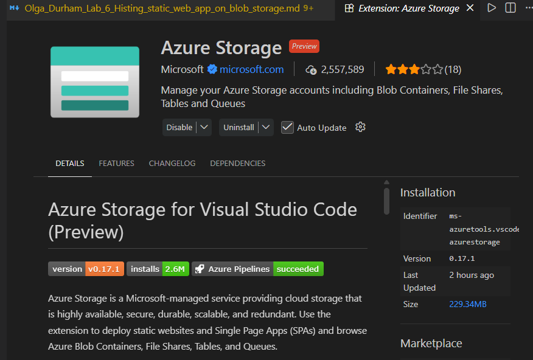
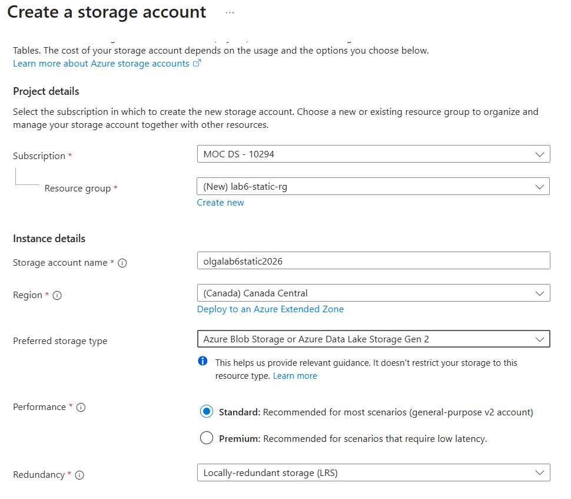
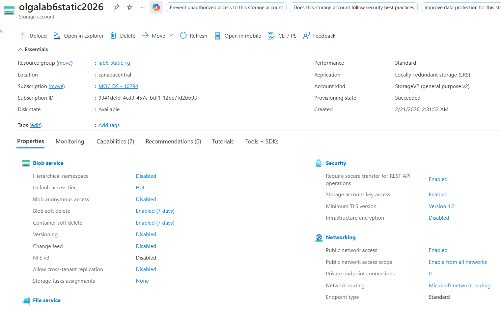
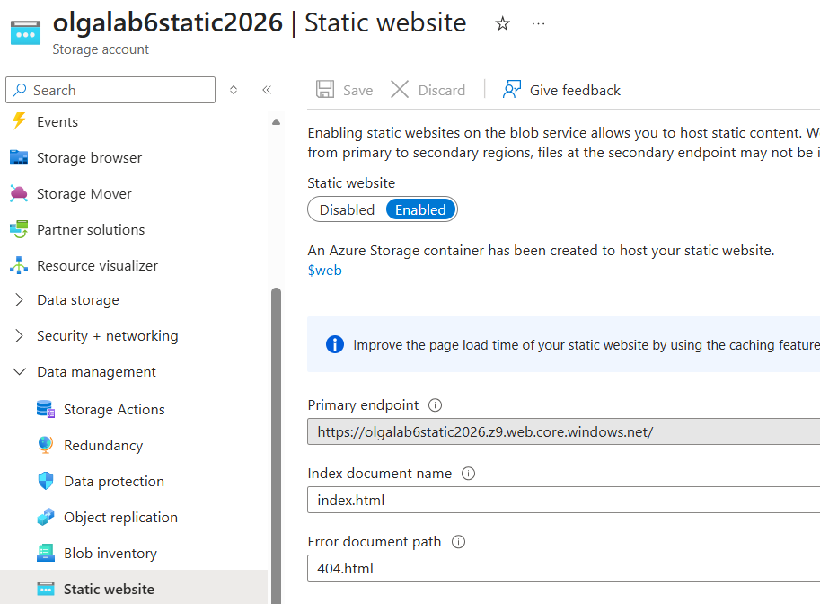
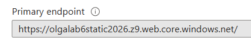
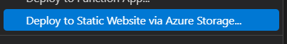
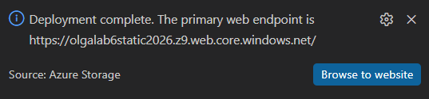
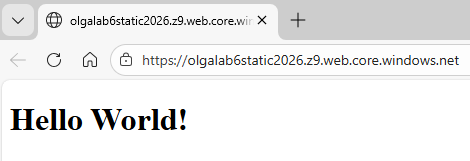
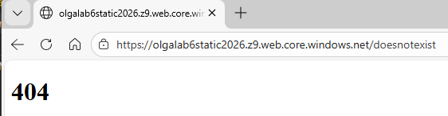
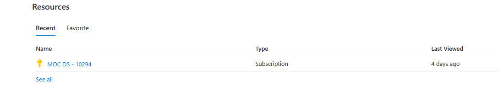

# CST8921 – Cloud Industry Trends

## Lab 6 – Hosting static web app on blob storage 

**Completed by: Olga Durham**
**St#: 040687883**

---

### Introduction 

In this lab, students will explore and understand cloud storage account. Cloud Storage Account is a storage offering that is designed to support and enhance the capabilities of systems that are serving documents, files, images, video and logs files at scale with features such as high availability and replications. The primary service of the storage account, Blob storage supports low-cost and tiered storage with high availability and strong consistency to provide fast and reliable disaster recovery solutions for a massive amount of data.
Static website is one of the newly introduced capabilities of Cloud Storage Account that supports hosting static HTML-based website and associated assets to host website. The hosting does not require any rendering or management of the hosting platform. If companies are looking to host a simple landing page or static content, a Static website with Cloud Storage might be the best option for the organization.

---

### Objective (In my own words)

The objective of this lab was to gain practical experience in configuring and deploying a static website using Azure Blob Storage. Through this process, I developed a deeper understanding of how cloud storage accounts function, how static website hosting is enabled within Azure, and how local development tools such as Visual Studio Code integrate with cloud services. This lab allowed me to explore the concept of serverless static hosting, where no traditional web server management is required, and to understand how Azure generates public endpoints to make content globally accessible. Additionally, I learned the importance of resource management in cloud environments, including selecting appropriate redundancy options and properly deleting resources to prevent unnecessary costs. Overall, this activity strengthened my understanding of cloud-based web hosting and reinforced the scalability and cost-effectiveness of solutions in real-world cloud environments.

---

### Prerequisites

- Basic understanding of cloud storage types
- A computer with internet access 
- Windows or mac machine
- Web browser
- Cloud portal access with any cloud service providers (AWS, Azure, GCP)

---

### Lab Activity Overview

#### Part A: Environment Setup

##### Step 1: Launch Visual Studio Code

- Open **Visual Studio Code** on your computer.

##### Step 2: Install Azure Storage Extension

1. Open the **Extensions** panel.
2. Search for **Azure Storage.**
3. Install the extension published by Microsoft.

*Figure 1: Azure Storage Extension Installed in VS Code* \

#### Part B: Azure Portal Configuration

##### Step 3: Log in to Azure Portal

- Navigate to: https://portal.azure.com
- Sign in using your Azure account.

##### Step 4: Create a Storage Account

1. In the Azure Portal, search for **Storage accounts.**
2. Click **Create.**
3. Select:
    - Subscription
    - Resource Group (create a new one if required)
4. Enter:
    - Storage account name (must be globally unique)
    - Region (closest to your location)
5. Leave all other settings as default.
6. Click **Review + Create,** then **Create.**

*Figure 2: Storage Account Configuration (Basics Tab)* \

*Figure 3: Storage Account Successfully Created* \

##### Step 5: Enable Static Website Hosting

1. Open the newly created storage account.
2. In the left navigation pane, select **Static website.**
3. Set **Static website** to **Enabled.**
4. Configure:
    - **Index document name:** `index.html`
    - **Error document path:** `404.html`
5. Click **Save.**

Once saved, Azure will generate a **Primary endpoint URL** for your website.

*Figure 4: Static Website Enabled* \

*Figure 5: Primary Endpoint URL Generated* \

<!-- https://olgalab6static2026.z9.web.core.windows.net/ -->

#### Part C: Create the Static Website Locally

##### Step 6: Create Website Folder

1. Create a new folder on your local machine named:
2. `mywebsite`
3. Open this folder in **Visual Studio Code.**

##### Step 7: Create index.html

1. Inside the `mywebsite` folder, create a file named:
2. index.html
3. Paste the following content and save:
<!DOCTYPE html>
<html>
  <body>
    <h1>Hello World!</h1>
  </body>
</html>

##### Step 8: Create 404.html

1. Create another file named:
2. 404.html
3. Paste the following content and save:

<!DOCTYPE html>
<html>
  <body>
    <h1>404</h1>
  </body>
</html>

#### Part D: Deploy Website to Azure

##### Step 9: Deploy to Static Website

1. In VS Code Explorer, **right-click** the `mywebsite` folder.
2. Select **Deploy to Static Website.**
3. Choose:
    - Azure subscription
    - Storage account you created earlier
4. Wait for the deployment to complete.

*Figure 6: Deploy to Static Website from VS Code* \

*Figure 7: Deployment Successful Message* \

##### Step 10: Validate Deployment

1. Return to the **Azure Portal.**
2. Open **Storage Account → Static website.**
3. Click the **Primary endpoint URL.**
4. Confirm:
    - “Hello World!” page loads successfully
    - Navigating to a non-existent page displays the **404** page

*Figure 8: Hello World Page Displayed Successfully* \

*Figure 9: 404 Page Displayed for Invalid URL* \

#### Part E: Cleanup (Mandatory)

##### Step 11: Delete Resources

1. In Azure Portal, navigate to **Resource Groups.**
2. Select the resource group used for this lab.
3. Click **Delete resource group.**
4. Confirm deletion.

This step ensures no unnecessary cloud resources remain active.

*Figure 10: Resources Deleted* \

---

### Issues Encountered

During the lab, no major technical errors occurred; however, there were a few minor challenges. One issue was understanding the difference between testing the website locally (using the localhost address) and testing it through the Azure public endpoint. Initially, both URLs displayed the same content, but only the Azure endpoint confirmed that the site was successfully deployed to the cloud.

Another consideration was selecting the appropriate storage redundancy option (LRS vs. GRS). Understanding the cost and replication differences between these options required reviewing Azure’s documentation to ensure an appropriate selection for a simple static website.

Additionally, it was important to ensure that the correct files (`index.html` and `404.html`) were deployed to the `$web` container and that the static website feature was enabled before testing the public URL. Verifying these configurations helped prevent potential deployment or access issues.

Overall, the challenges were minor and helped reinforce my understanding of Azure configuration settings and cloud deployment workflows.

---

### Final Observations and Learning Outcomes

Through this lab, I gained practical experience working with Azure Blob Storage and static website hosting. I learned how cloud storage accounts can be configured to serve web content without requiring traditional server infrastructure, demonstrating the advantages of serverless architecture. This activity reinforced my understanding of how cloud services simplify deployment, improve scalability, and reduce operational overhead.

Additionally, I developed hands-on experience integrating local development tools with cloud platforms and managing cloud resources responsibly. Overall, this lab strengthened my understanding of cloud-based web hosting solutions and highlighted how cost-effective and scalable infrastructure can be implemented in real-world environments.