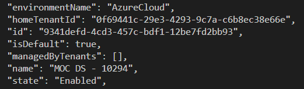
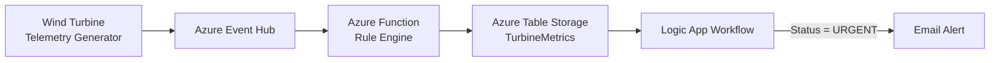
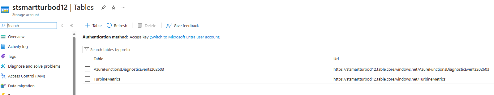
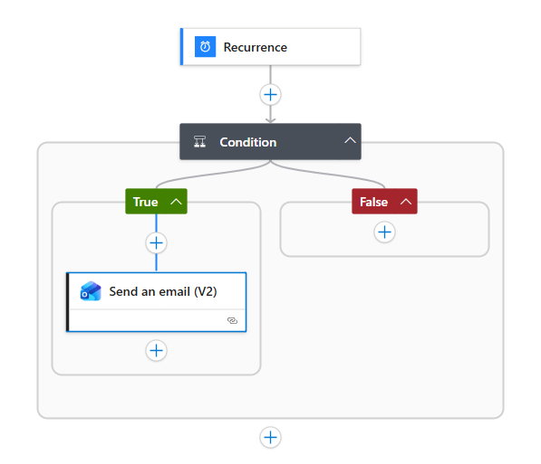
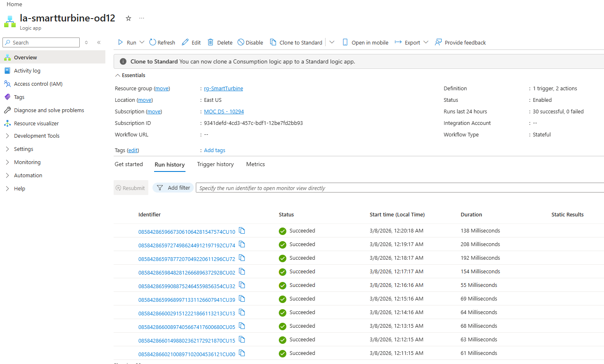
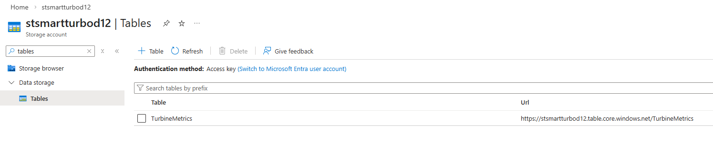
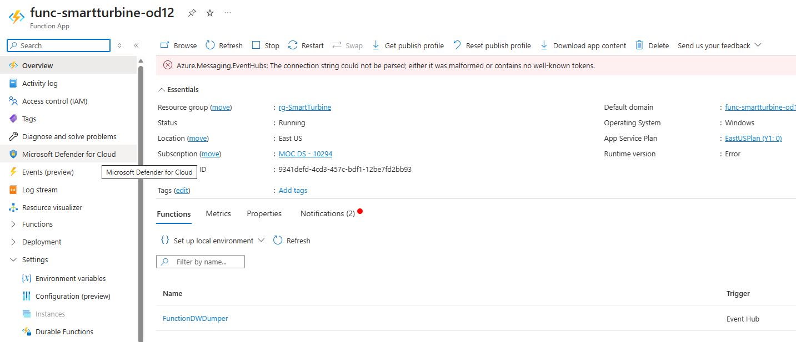
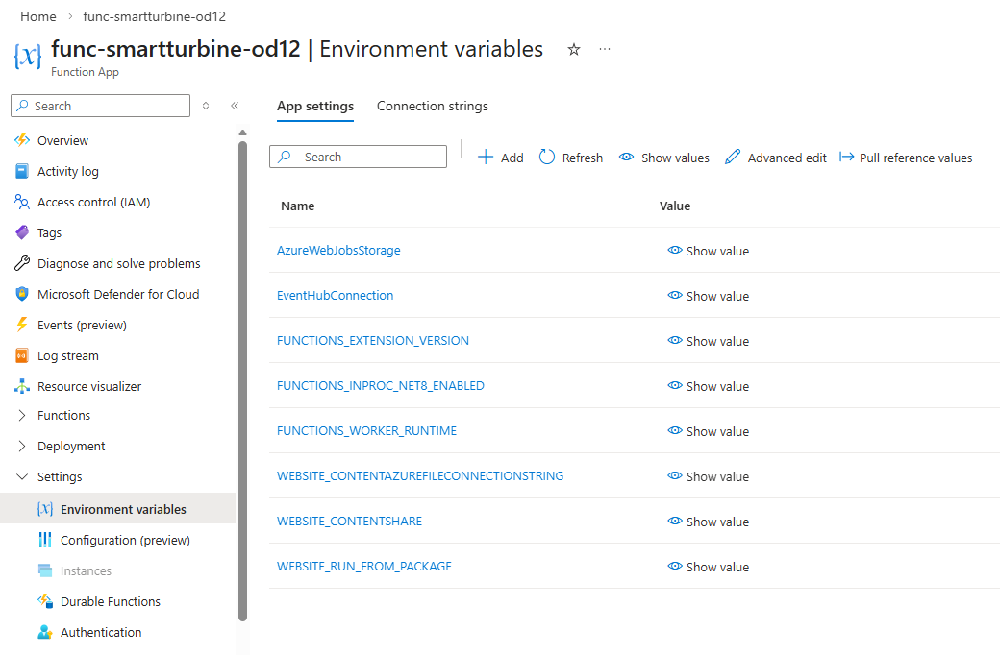

# CST8921 – Cloud Industry Trends 

## Lab 7 Report – Serverless Computing

**Completed by: Olga Durham** \
**St#: 040687883**

---

## Lab Objective

The objective of this lab was to design and implement a serverless monitoring pipeline using Microsoft Azure services. The system processes telemetry data from wind turbines, evaluates turbine health using an Azure Function rule engine, stores processed metrics in Azure Table Storage, and triggers automated alerts using a Logic App workflow.

Through this implementation, the lab demonstrates how serverless cloud services can be combined to create scalable, event-driven architectures that process data and automate operational responses without managing server infrastructure.

---

## Azure Environment Verification

The Azure CLI was used to verify the active subscription and tenant configuration for the lab environment.

*Figure 1. Azure Account Verification*

---

## Architecture Overview

This lab implements a serverless, event-driven workflow for processing wind turbine telemetry data. In the intended architecture, telemetry generated by the turbine simulator is sent to Azure Event Hubs and processed by an Azure Function acting as a rule engine. The function evaluates incoming telemetry and stores the processed metrics in Azure Table Storage.

The Azure Function determines turbine health based on wind speed and generated power. If wind speed exceeds the defined threshold while generated power remains low, the turbine status is marked as **URGENT**; otherwise, it is recorded as **HEALTHY**. The results are stored in the `TurbineMetrics` table using the device identifier as the partition key and the timestamp as the row key.

A Logic App workflow monitors the stored telemetry data and automatically sends an email alert when an urgent condition is detected. This architecture demonstrates how serverless cloud services can be integrated to process telemetry data, store structured metrics, and automate operational alerts.

### Architecture Diagram

*Figure 2. Serverless Wind Turbine Monitoring Architecture*

#### Key Architecture Components

The serverless monitoring system implemented in this lab consists of the following components:

| Component                        | Description                                                                                                                                                                                                |
| -------------------------------- | ---------------------------------------------------------------------------------------------------------------------------------------------------------------------------------------------------------- |
| **Telemetry Source**             | A wind turbine data generator simulates telemetry data such as wind speed, turbine speed, and generated power.                                                                                             |
| **Azure Function (Rule Engine)** | The `FunctionDWDumper` Azure Function processes incoming telemetry events, evaluates turbine health status using rule-based logic, and determines whether the turbine status is **HEALTHY** or **URGENT**. |
| **Azure Table Storage**          | Processed telemetry metrics are stored in the `TurbineMetrics` table using the device identifier as the partition key and the timestamp as the row key.                                                    |
| **Logic App Workflow**           | The Logic App monitors turbine status values and automatically triggers an email notification when an **URGENT** condition is detected.                                                                    |
| **Email Notification**           | When a critical turbine condition is identified, an automated email alert is sent to notify system operators.                                                                                              |

Together, these components form a serverless, event-driven monitoring pipeline that processes telemetry data, evaluates system health, stores structured metrics, and automates operational alerts.

#### Architecture Diagram Description

Figure 2 illustrates the serverless architecture implemented in this lab. Telemetry data generated by the wind turbine simulator is intended to be sent to Azure Event Hubs, which acts as the event ingestion layer. The events are processed by an Azure Function that evaluates telemetry values such as wind speed and generated power to determine the turbine health status.

The processed results are stored in Azure Table Storage within the `TurbineMetrics` table using the device identifier as the partition key and the timestamp as the row key. A Logic App workflow monitors the stored telemetry data and triggers an automated email alert when a turbine status is classified as **URGENT**.

This architecture demonstrates how serverless services can be combined to process telemetry data, store structured metrics, and automate operational alerts without managing infrastructure.

**Storage Account Tables**

Azure Table Storage is used to store structured telemetry data produced by the Azure Function.

*Figure 3. Storage account tables*

### Logic App Workflow

*Figure 4. Logic App workflow used for alert automation*

### Logic App Resource Overview

The Logic App resource was deployed in the `rg-SmartTurbine` resource group and configured to execute the alert workflow.

*Figure 5. Logic App Overview*

---

## Implementation Steps Summary

The following steps summarize the implementation of the serverless monitoring system developed in this lab:

1. **Infrastructure Setup**
   A new Azure resource group (`rg-SmartTurbine`) was created to organize all lab resources. A storage account (`stsmartturbod12`) was deployed in the East US region to support Azure Functions and Table Storage.

2. **Table Storage Configuration**
   A NoSQL table named `TurbineMetrics` was created within the storage account. This table stores processed telemetry metrics generated by the Azure Function, including turbine status and operational parameters.

    

    **Turbine Metrics Table**

    The `TurbineMetrics` table stores the processed telemetry metrics generated by the Azure Function.

    

    *Figure 6. TurbineMetrics Table*

3. **Azure Function Deployment**
   A .NET isolated Azure Function project (`FunctionDWDumper`) was created locally. The function processes telemetry events, evaluates turbine health using predefined rules, and writes structured results into the `TurbineMetrics` table.

   **Azure Function Deployment**

    The `FunctionDWDumper` Azure Function was successfully deployed to the `func-smartturbine-od12` Function App.

    

    *Figure 7. Azure Function*

    

    **Function App Environment Variables**

    The Function App environment variables were configured to support the serverless processing pipeline.

    

    *Figure 8. Function App environment variables*

4. **Rule Engine Implementation**
   The function implements logic that determines turbine health status based on telemetry values. When wind speed exceeds the threshold while generated power remains low, the turbine status is marked as **URGENT**; otherwise, it is recorded as **HEALTHY**.

5. **Function App Deployment**
   The Azure Function project was built and deployed to the Azure Function App (`func-smartturbine-od12`). Required application settings such as `AzureWebJobsStorage`, `FUNCTIONS_WORKER_RUNTIME`, and `EventHubConnection` were configured in the environment variables.

6. **Logic App Workflow Creation**
   A Logic App (`la-smartturbine-od12`) was created to automate alerting based on turbine health status. The workflow evaluates stored telemetry results and triggers an email notification when an **URGENT** condition is detected.

7. **Environment Constraints Handling**
   Certain services described in the lab instructions, including Azure Event Hubs and the Azure Table Storage Logic App trigger, were restricted by the CloudLabs training environment. Alternative configuration steps were used where necessary while maintaining the intended serverless architecture and automation workflow.

---

## Findings and Analysis

During the implementation of the serverless architecture, several limitations related to the CloudLabs training environment were encountered. The lab instructions required Azure Event Hubs for telemetry ingestion and an Azure Table Storage trigger in Logic Apps. However, these components were partially restricted by policies applied to the CloudLabs subscription.

The creation of the Event Hub namespace was blocked by an Azure Policy restriction, which prevented the telemetry ingestion pipeline from being implemented exactly as described in the lab instructions. Despite this limitation, the Azure Function application was successfully developed, built, and deployed. The function implements the rule engine logic that evaluates turbine telemetry data and determines the turbine health status based on wind speed and generated power thresholds.

Another limitation occurred when configuring the Logic App workflow. The expected Azure Table Storage trigger was not available in the Logic App designer in the CloudLabs environment. As a result, an alternative trigger approach was used while maintaining the intended alert automation logic.

Despite these restrictions, the core components of the solution—including the Azure Function rule engine, Azure Table Storage for telemetry persistence, and the Logic App workflow—were successfully implemented. The system demonstrates how serverless cloud services can be used to process telemetry data and automate monitoring tasks.

---

## Conclusion

This lab provided practical experience with serverless computing in Microsoft Azure. The implementation demonstrated how cloud services can be used to process telemetry data, evaluate turbine health conditions, and automate operational alerts without managing server infrastructure.

An Azure Function was developed to process telemetry data and apply rule-based logic to determine turbine health status. The processed metrics were stored in Azure Table Storage, and a Logic App workflow was created to automate alert notifications when urgent conditions occur.

Although some services described in the lab instructions were restricted by the CloudLabs training subscription, the core architecture was successfully implemented. Alternative configurations were used where necessary while preserving the intended serverless workflow.

Overall, the lab illustrates how serverless architectures enable scalable, automated data-processing pipelines using managed cloud services.

---
