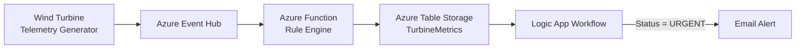

# CST8921 – Cloud Industry Trends 

## Lab 7 Report – Serverless Computing

**Completed by: Olga Durham** \
**St#: 040687883**

---

## Lab Objective

The objective of this lab was to design and implement a serverless monitoring pipeline using Microsoft Azure services. The system processes telemetry data from wind turbines, evaluates turbine health using an Azure Function rule engine, stores processed metrics in Azure Table Storage, and triggers automated alerts using a Logic App workflow.

Through this implementation, the lab demonstrates how serverless cloud services can be combined to create scalable, event-driven architectures that process data and automate operational responses without managing server infrastructure.

---

## Architecture Overview

The architecture implemented in this lab demonstrates a serverless, event-driven workflow for processing telemetry data from wind turbines. In the intended design, telemetry generated by the turbine simulator is sent to Azure Event Hubs, where it is consumed by an Azure Function acting as a rule engine. The Azure Function evaluates the incoming telemetry data, calculates the turbine health status, and writes the processed metrics into Azure Table Storage.

The Azure Function contains logic that determines the turbine’s health condition based on two telemetry values: wind speed and generated power. If the wind speed exceeds a defined threshold while the generated power remains low, the system flags the turbine as **URGENT**. Otherwise, the turbine status is recorded as **HEALTHY**. The processed data is stored in the `TurbineMetrics` table using the device identifier as the partition key and the timestamp as the row key.

A Logic App workflow is used to automate alerting based on the stored telemetry data. The workflow evaluates turbine status values and triggers an email notification when an urgent condition is detected. This automation demonstrates how serverless cloud services can be integrated to create reactive operational monitoring systems without managing underlying infrastructure.

Although some services were restricted in the CloudLabs environment, the implemented solution preserves the intended serverless architecture: telemetry ingestion, serverless processing, persistent storage, and automated alerting.

### Architecture Diagram

*Figure 1. Serverless Wind Turbine Monitoring Architecture*

#### Key Architecture Components

The serverless monitoring system implemented in this lab consists of the following components:

| Component                        | Description                                                                                                                                                                                                |
| -------------------------------- | ---------------------------------------------------------------------------------------------------------------------------------------------------------------------------------------------------------- |
| **Telemetry Source**             | A wind turbine data generator simulates telemetry data such as wind speed, turbine speed, and generated power.                                                                                             |
| **Azure Function (Rule Engine)** | The `FunctionDWDumper` Azure Function processes incoming telemetry events, evaluates turbine health status using rule-based logic, and determines whether the turbine status is **HEALTHY** or **URGENT**. |
| **Azure Table Storage**          | Processed telemetry metrics are stored in the `TurbineMetrics` table using the device identifier as the partition key and the timestamp as the row key.                                                    |
| **Logic App Workflow**           | The Logic App monitors turbine status values and automatically triggers an email notification when an **URGENT** condition is detected.                                                                    |
| **Email Notification**           | When a critical turbine condition is identified, an automated email alert is sent to notify system operators.                                                                                              |

Together, these components form a serverless, event-driven monitoring pipeline that processes telemetry data, evaluates system health, stores structured metrics, and automates operational alerts.

#### Architecture Diagram Description

Figure 1 illustrates the serverless architecture implemented in this lab. Telemetry data generated by the wind turbine simulator is intended to be sent to Azure Event Hubs, which acts as the event ingestion layer. The incoming telemetry events are processed by an Azure Function that serves as a rule engine. The function evaluates key telemetry parameters such as wind speed and generated power to determine the health status of the turbine.

After processing the telemetry data, the Azure Function stores the structured results in Azure Table Storage within the `TurbineMetrics` table. Each record uses the device identifier as the partition key and the telemetry timestamp as the row key. This storage structure allows efficient retrieval and organization of turbine metrics.

A Logic App workflow monitors the stored telemetry data and evaluates turbine status values. When a turbine is classified as **URGENT**, the Logic App triggers an automated email notification to alert operators about a potential turbine failure. This architecture demonstrates how serverless services can be combined to build an automated monitoring and alerting pipeline without managing underlying infrastructure.

### Logic App Workflow

*Figure 2. Logic App workflow used for alert automation*

---

## Implementation Steps Summary

The following steps summarize the implementation of the serverless monitoring system developed in this lab:

1. **Infrastructure Setup**
   A new Azure resource group (`rg-SmartTurbine`) was created to organize all lab resources. A storage account (`stsmartturbod12`) was deployed in the East US region to support Azure Functions and Table Storage.

2. **Table Storage Configuration**
   A NoSQL table named `TurbineMetrics` was created within the storage account. This table stores processed telemetry metrics generated by the Azure Function, including turbine status and operational parameters.

3. **Azure Function Deployment**
   A .NET isolated Azure Function project (`FunctionDWDumper`) was created locally. The function processes telemetry events, evaluates turbine health using predefined rules, and writes structured results into the `TurbineMetrics` table.

4. **Rule Engine Implementation**
   The function implements logic that determines turbine health status based on telemetry values. When wind speed exceeds the threshold while generated power remains low, the turbine status is marked as **URGENT**; otherwise, it is recorded as **HEALTHY**.

5. **Function App Deployment**
   The Azure Function project was built and deployed to the Azure Function App (`func-smartturbine-od12`). Required application settings such as `AzureWebJobsStorage`, `FUNCTIONS_WORKER_RUNTIME`, and `EventHubConnection` were configured in the environment variables.

6. **Logic App Workflow Creation**
   A Logic App (`la-smartturbine-od12`) was created to automate alerting based on turbine health status. The workflow evaluates stored telemetry results and triggers an email notification when an **URGENT** condition is detected.

7. **Environment Constraints Handling**
   Certain services described in the lab instructions, including Azure Event Hubs and the Azure Table Storage Logic App trigger, were restricted by the CloudLabs training environment. Alternative configuration steps were used where necessary while maintaining the intended serverless architecture and automation workflow.

---

## Findings and Analysis

During the implementation of the serverless architecture, several limitations related to the CloudLabs training environment were encountered. The lab instructions required the use of Azure Event Hubs to ingest telemetry data and an Azure Table Storage trigger in Logic Apps to monitor the `TurbineMetrics` table. However, these components were partially restricted by Azure policies applied to the CloudLabs subscription.

The creation of the Event Hub namespace was blocked by an Azure Policy restriction. As a result, the full telemetry ingestion pipeline described in the lab instructions could not be implemented exactly as specified. Despite this limitation, the Azure Function application was successfully developed, built, and deployed to the cloud environment. The function code implements the required rule engine logic to evaluate wind turbine telemetry and determine turbine health status based on wind speed and generated power thresholds.

Another limitation occurred when configuring the Logic App workflow. The expected Azure Table Storage trigger described in the lab instructions was not available in the Logic App designer within the CloudLabs tenant. Because of this restriction, the workflow was implemented using an alternative trigger approach while maintaining the intended automation logic. The Logic App still demonstrates the automated monitoring pattern required by the lab by evaluating turbine status values and triggering an alert workflow.

Despite the tenant restrictions, the overall architecture of the solution was successfully implemented. The core components—including the Azure Function rule engine, Azure Table Storage for telemetry persistence, and the Logic App automation workflow—were configured and deployed. The system demonstrates how serverless cloud services can be used to process telemetry data, store structured metrics, and automate operational alerts.

These limitations highlight an important practical consideration in cloud development: environment policies and subscription restrictions can affect available services. Developers must sometimes adapt their implementation while preserving the architectural intent of the system.

---

## Conclusion

This lab provided practical experience with serverless computing in Microsoft Azure. By building and deploying a serverless workflow, the lab demonstrated how cloud-native services can be used to process telemetry data, evaluate system health conditions, and automate operational alerts without managing server infrastructure.

The implementation included the deployment of an Azure Function that processes telemetry data and applies rule-based logic to determine turbine health status. The processed telemetry was stored in Azure Table Storage, enabling structured and cost-efficient storage of turbine metrics. A Logic App workflow was also created to demonstrate automated alerting based on turbine health conditions.

During the lab, certain services such as Azure Event Hubs and specific Logic App connectors were restricted by the CloudLabs training subscription policies. Despite these limitations, the core components of the architecture were successfully implemented, and alternative configurations were used to demonstrate the intended automation workflow.

Overall, the lab illustrates the advantages of serverless cloud architectures, including simplified deployment, automatic scaling, and the ability to build responsive data-processing pipelines using managed cloud services.

---

